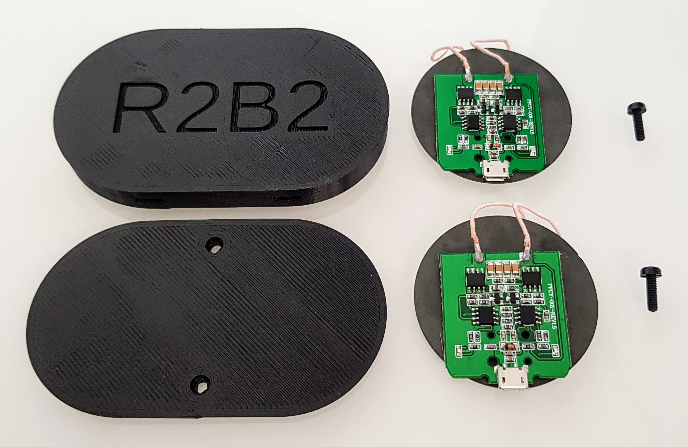
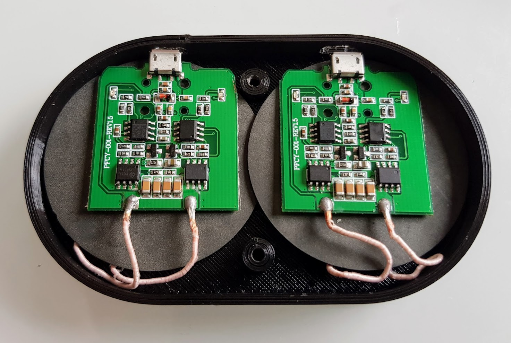
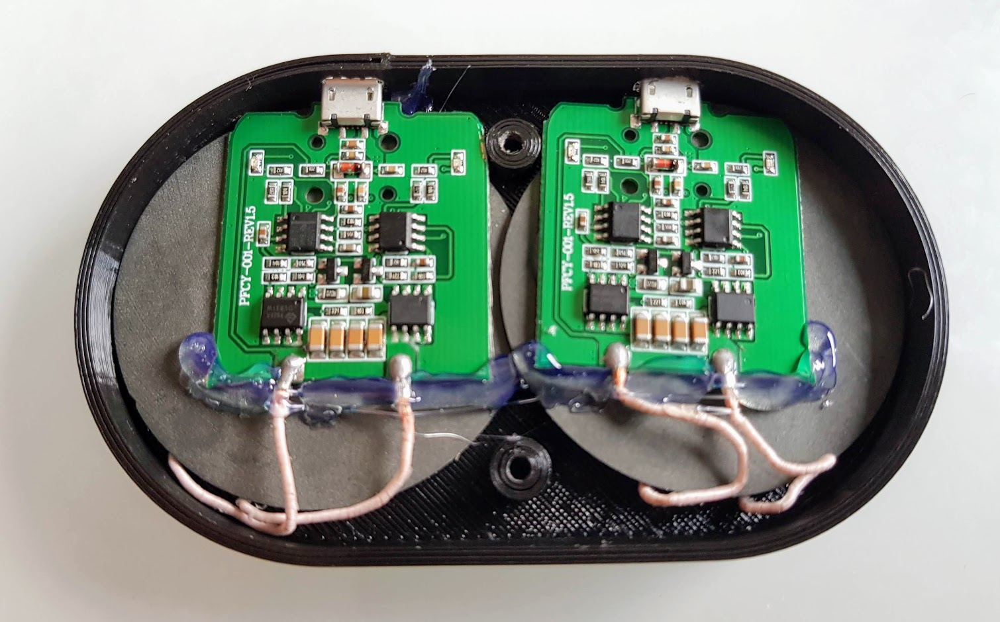
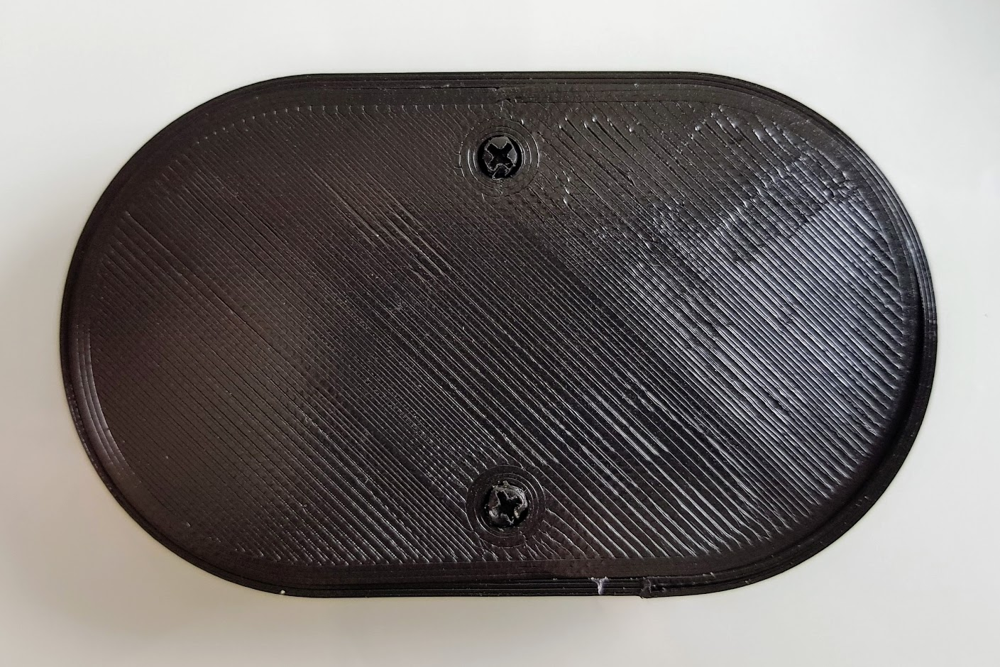
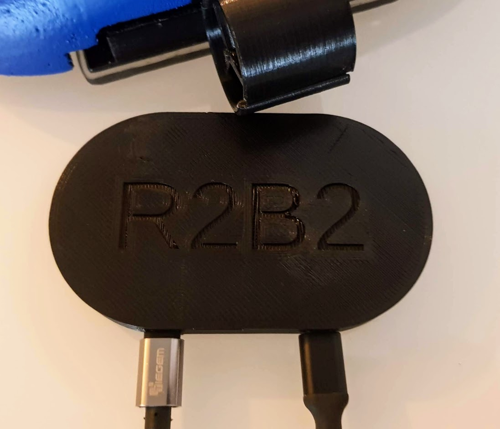

1. Base de Càrrega
==================

1.1. Que necessitem?
********************

1.1.1 Material
--------------

*  1x Base Carrega Top `(Fitxer STL) <https://github.com/r2b2osrov/r2b2-nano/blob/master/design/stl/base.stl>`_
*  1x Base Carrega Down `(Fitxer STL) <https://github.com/r2b2osrov/r2b2-nano/blob/master/design/stl/base_b.stl>`_
*  2x Cargols M3 x 4mm 
*  2x Qi Wireless Power Charging
*  Cola Tèrmica

1.1.2 Eines
-----------

*  Tornavís 
*  Pistola Cola Tèrmica
*  Guants

1.2 Muntatge
************

