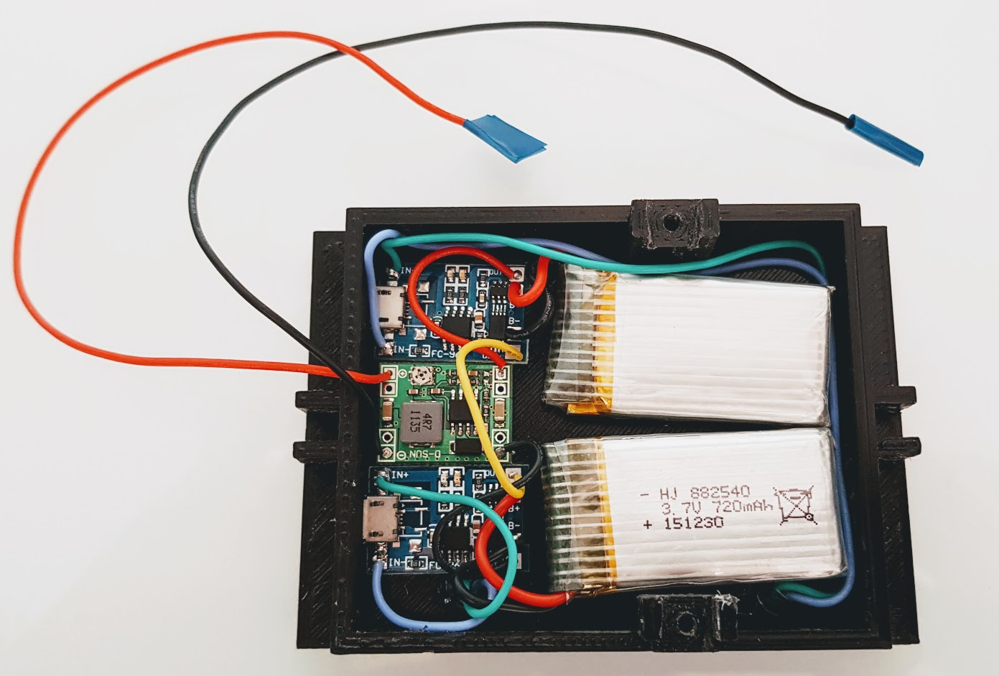

=======================
5.2. Xassís Alimentació
=======================

5.2.1. Que necessitem?
**********************

5.2.1.1 Material
----------------

*  1x `Xassís Alimentació <../design/index.html#xassis>`_ `(Fitxer STL) <https://github.com/r2b2osrov/r2b2-nano/blob/master/design/stl/chassis.stl>`_
*  2x `Mòdul TP4056 <../electro/index.html#tp4056-dw01a>`_ (Cargador de bateria) 
*  2x `Receptor Qi Wireless Charger <../electro/index.html#cargador-qi-i-receptor-qi>`_
*  2x `3.7V 550mAh Battery <../electro/index.html#bateria-lipo>`_
*  1x `Regulador voltage <../electro/index.html#reguladors-de-voltatge>`_ (8v --> 5.5v)
*  `Cable elèctic de silicona 28 AWG <80_materials.html#cable-silicona-28awg>`_
*  `Estany <80_materials.html#estany>`_
*  `Cola Tèrmica <80_materials.html#cola-temica>`_
*  `Resina de poliester i catalitzador <80_materials.html#resina-poliester>`_
*  Cinta aïllant

5.2.1.2 Eines
-------------

*  `Soldador <81_tools.html#soldador>`_
*  Estenalles d'electrònica 
*  Motlles de Silicona per contenir la resina
*  Guants
*  Mascara
*  Ulleres de protecció
*  Trepant i broca petita
*  `Pistola Cola Tèrmica <81_tools.html#pistola-de-cola-termica>`_
*  Serra/llima per treure els excessos de resina
*  Tester

5.2.2 Muntatge
**************

Es pot trobar l'esquema electrònic "r2b2-nano-power" al projecte públic `R2B2-nano <https://easyeda.com/r2b2osrov/r2b2-nano>`_ allotjat a EasyEDA.

.. image:: ../electro/10_power/10_01_power_schematic.png

Primer de tot tallem els cables de la bateria LiPo. 

.. warning:: Cal tallar els cables d'un en un per no creuar els cables i dañar les bateries!!! 

Soldem els cables de les bateries als mòduls de càrrega TP4056 tinguent en compte que el vermell ha d'anar al B+ i el negre al B-.

.. image:: 20_power_images/20_02_power_assembly.jpg

Per posar les bateries en sèrie connectarem la sortida OUT+ d'un mòdul TP4065 amb l'OUT- de l'altre mòdul.

Soldarem un cable a la sortides restants de cada mòdul TP4056 un a l'OUT+ i l'altre a l'OUT-. 

.. note:: Si sempre cablejem les masses amb color negre i els pols positius amb vermell ens ajudarà a identificar els cables més facilment i comentre menys errors.

.. image:: 20_power_images/20_04_power_assembly.jpg

Ara connectem el OUT+ del modul TP4056 a l'IN+ del regulador de voltatge i l'OUT- a l'IN-.

Arribats a aquest punt podem comprovar amb un tester que el voltage que ens dona és correcte.

.. image:: 20_power_images/20_07_power_assembly.jpg

Ara agafem els receptors Qi i els hi traiem els adhesius.

.. image:: 20_power_images/20_08_power_assembly.jpg

Amb el soldador, dessoldem el port USB.

.. image:: 20_power_images/20_10_power_assembly.jpg

.. image:: 20_power_images/20_11_power_assembly.jpg

I hi soldem dos cables de silicona nous.

.. image:: 20_power_images/20_13_power_assembly.jpg

Col·loquem els dos carregadors a la base de l'R2B2-nano i fem unes marques a on foradarem per passar els cables.

.. image:: 20_power_images/20_15_power_assembly.jpg

Foradem amb un trepant petit i una broca o fresadora.

.. image:: 20_power_images/20_16_power_assembly.jpg
.. image:: 20_power_images/20_17_power_assembly.jpg

Tornem a col·locar els receptors Qi a la base, però ara fent passar els cables nous pels forat i enganxant-los amb cola tèrmica.

.. image:: 20_power_images/20_18_power_assembly.jpg
.. image:: 20_power_images/20_19_power_assembly.jpg

Ara ja podem soldar cadascún dels receptors Qi al mòdul de càrrega. 

.. warning:: Cal comprovar amb un tester quin es el pol positiu i negatiu de cada receptor Qi. Per fer això posarem el receptor Qi modul sobre un emisor Qi endollat i connectarem els dos cables al tester. 

    És molt importart també posar els components amb la orientació correcte, ja que els cables d'alimentació accedeixen al xassís de control per un forat fet a proposit.

.. image:: 20_power_images/20_20_power_assembly.jpg

Arribats a aquest punt ja tenim la base d'alimentació apunt per enresinar. Només caldrà verificar que tenim la corrent de sortida desitjada amb un tester, tapar amb cinta aïllant els dos cables i colocar els element i cables dins al xassís de tal manera que no sobresurtin. 

Per enresinar podem fer servir qualsevol motlle de silicona, tan per fer la mescla com per contenir-la a l'hora de bolcar-la.

#.  Primer de tot farem una base d'1 a 2 milimetres de resina i la deixarem assecar.
#.  Col·locarem la base a dins al motlle sobre la resina seca.
#.  Prepararem més resina i la bolcarem dins el motlle fins a quasi arribar a l'alçada del suports.
#.  Un cop assecada la resina omplirem la base d'alimentació fins a cubrir tots els dispositius electrònics, cables i bateries. Només deixarem sortir els dos cables, positiu i negatiu, tal i com es motra a les següents imatges.

.. image:: 20_power_images/20_23_power_assembly.jpg
.. image:: 20_power_images/20_24_power_assembly.jpg

Un cop assecada la resina ja podem treure la base del motlle i retallar els sobrants amb una serra o trepant petit. 

.. image:: 20_power_images/20_25_power_assembly.jpg

Ja tenim la base d'alimentació apunt!!!

.. image:: 20_power_images/20_26_power_assembly.jpg
.. image:: 20_power_images/20_27_power_assembly.jpg
