5.3. Xassís Control
===================

5.3.1. Que necessitem?
**********************

5.3.1.1 Material
----------------

*  1x Xassís Control `(Fitxer STL) <https://github.com/r2b2osrov/r2b2-nano/blob/master/design/stl/chassis_b.stl>`_
*  1x R2B2-nano-board `R2B2-nano <https://easyeda.com/r2b2osrov/r2b2-nano>`_
*  1x ESP32 WROVER
*  2x Mòdul diver motor TB6612FNG
*  1x Mòdul Giroscopi/Accelerometre MPU6050
*  1x Registència 12k
*  1x Condensador tantalum 10 UF 16 V 106C
*  2x Condensador ceràmic 0.1 UF 104 
*  1x Regulador voltage 3.3V
*  1x Connector IPEX/U.FL 20278 1.13mm
*  1x Cable coaxial d'antena 1.13mm i 50ohm de 5metres
*  Cable elèctic de silicona 28 AWG
*  Estany
*  Resina de poliester i catalitzador

5.3.1.2 Eines
-------------

*  Soldador
*  Estenalles d'electrònica 
*  Guants
*  Mascara
*  Ulleres de protecció

5.3.2 Muntatge
**************

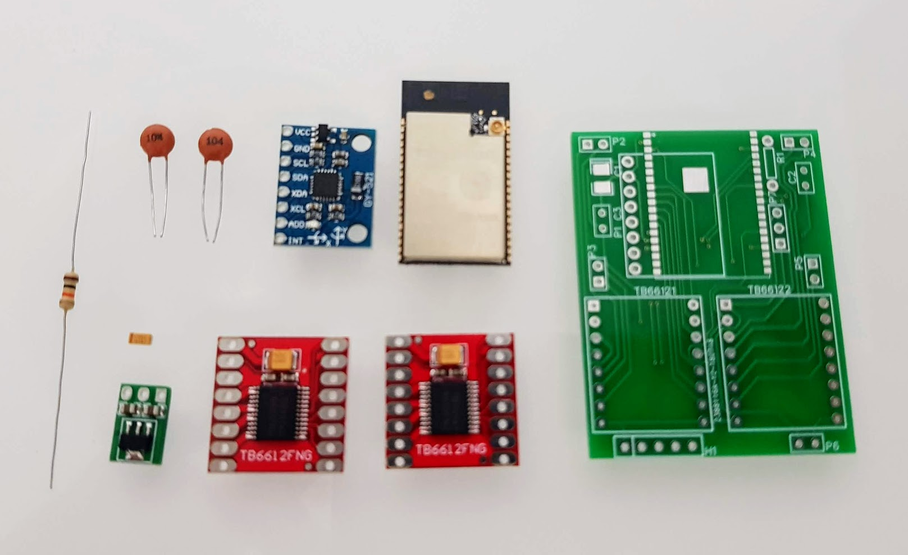

Es pot trobar l'esquema electrònic "r2b2-nano-board" al projecte públic `R2B2-nano <https://easyeda.com/r2b2osrov/r2b2-nano>`_ allotjat a EASEYEDA.

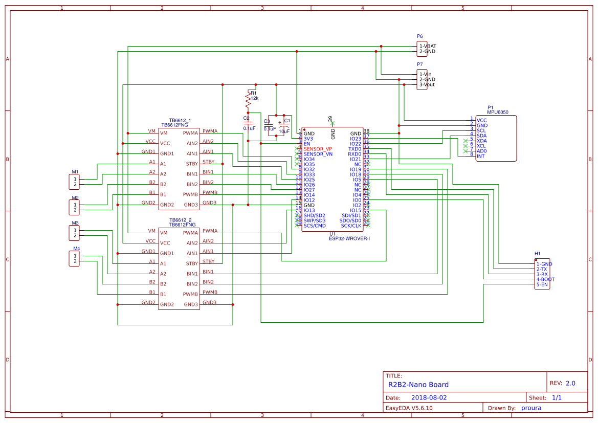
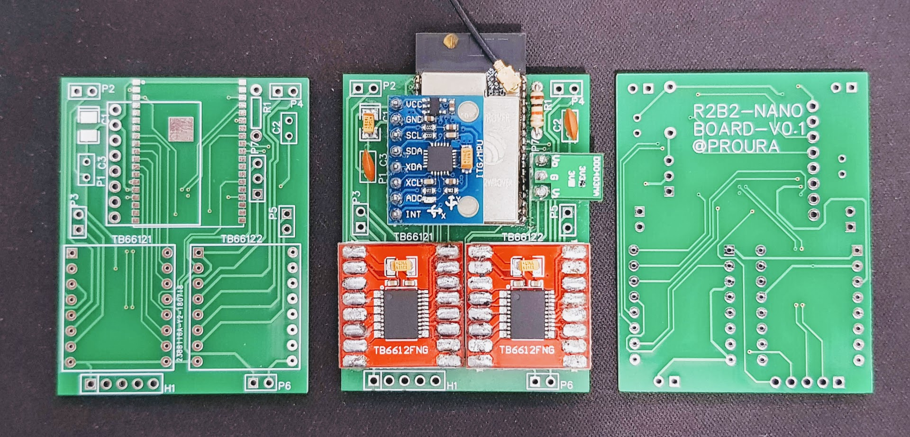
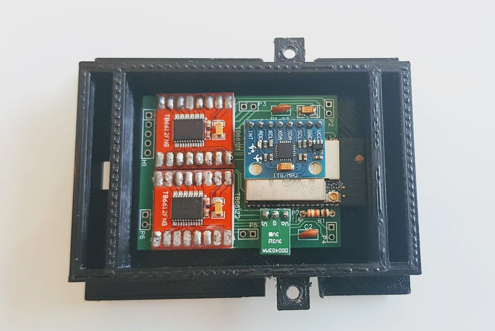
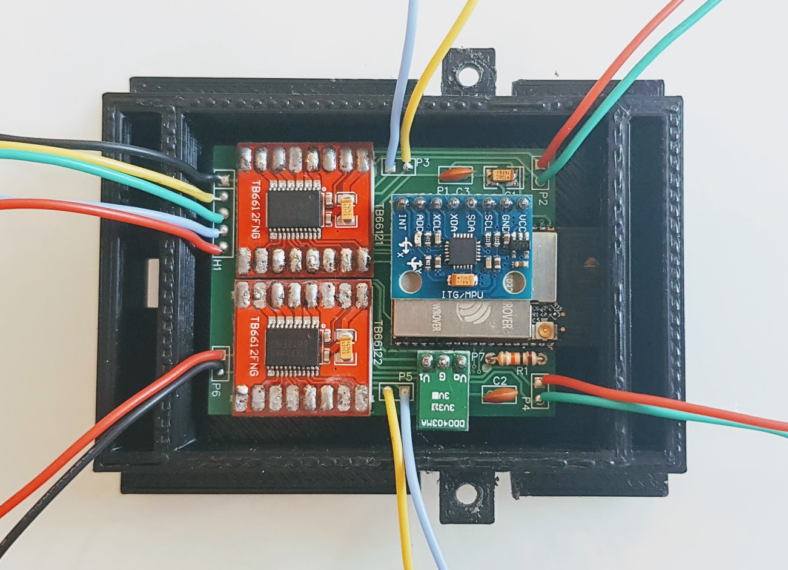
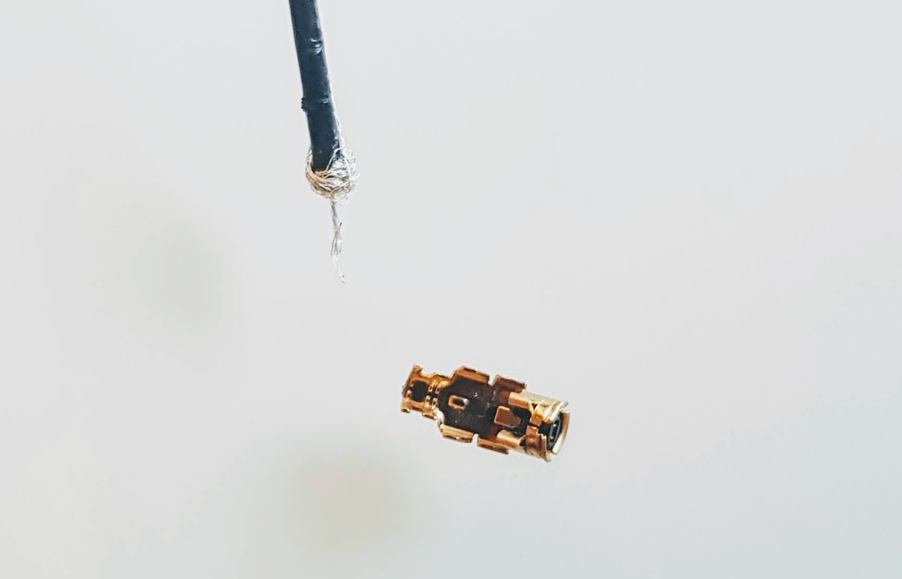
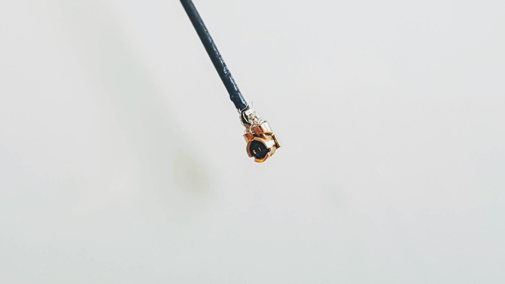
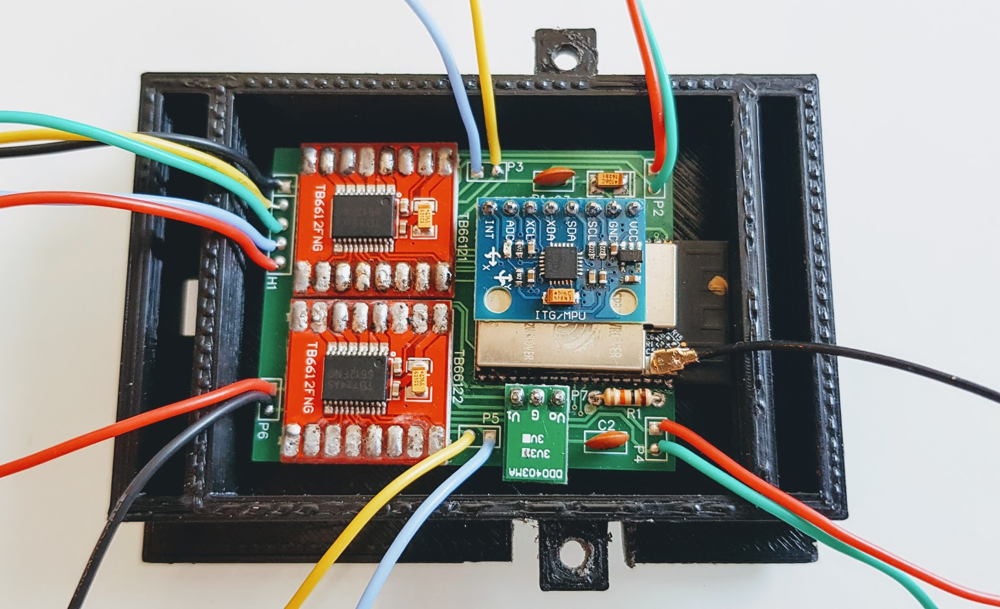
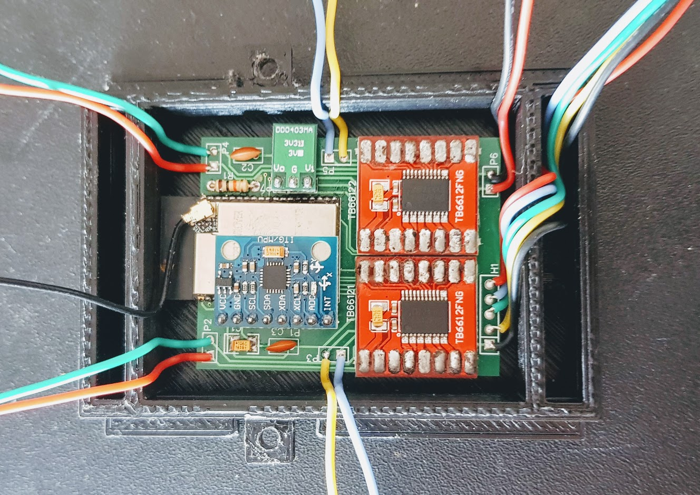
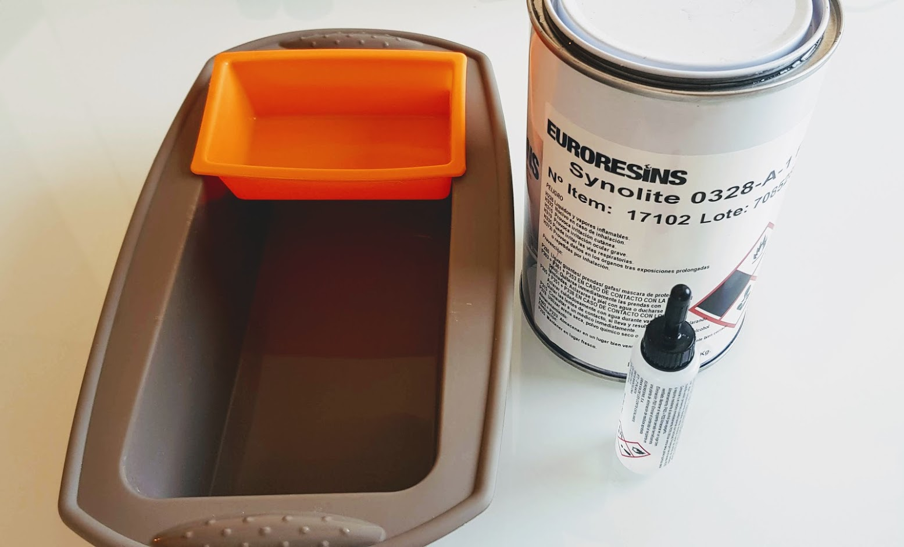
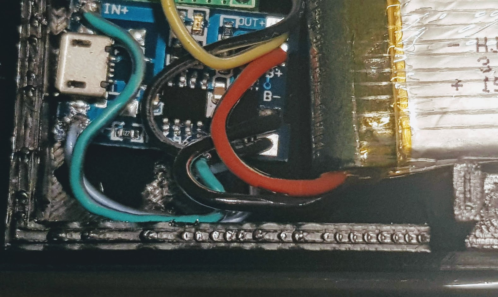

