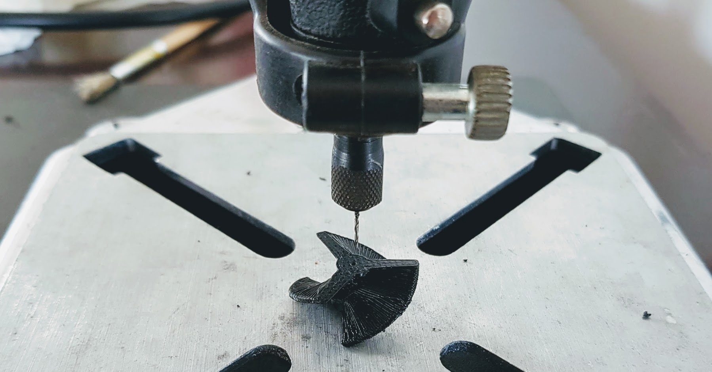

===============
5.4. Propulsors
===============

5.4.1. Que necessitem?
**********************

5.4.1.1 Material
----------------

*  4x Propulsor Part A `(Propulsor A STL) <https://github.com/r2b2osrov/r2b2-nano/blob/master/design/stl/half_thruster_A.stl>`_
*  4x Propulsor Part B `(Propulsor B STL) <https://github.com/r2b2osrov/r2b2-nano/blob/master/design/stl/half_thruster_B.stl>`_
*  4x Hèlix `(Hèlix STL) <https://github.com/r2b2osrov/r2b2-nano/blob/master/design/stl/propeller.stl>`_
*  4x Encapsulat Motors `(Encapsulat STL) <https://github.com/r2b2osrov/r2b2-nano/blob/master/design/stl/motor_housing.stl>`_
*  4x `Cargols sense cap M2 x 3mm <80_materials.html#cargols>`_
*  4x `Motors Drone (716 Coreless Motor) <../electro/index.html#motor-de-drone>`_
*  Vaselina
*  `Cola Tèrmica <80_materials.html#cola-temica>`_

5.4.1.2 Eines
-------------

*  `Pistola Cola Tèrmica <81_tools.html#pistola-de-cola-termica>`_
*  Trepant i broca petita
*  Espatula petita
*  Clau Allen 0.9mm

5.4.2 Muntatge
**************

.. figure:: 40_thrusters_images/40_01_thrusters_material.jpg
    :align: center

    Material per a muntar els Propulsors.

Primer de tot verificarem que els eixos dels motors poden entrar bé dins les hèlixs i que passen pel forat de l'encapsulat dels motors. En cas que sigui necessari farem el forat més ample amb el trepant petit.

Si el motors no te cap forat a la part d'on surt l'eix, hi posarem la vaselina directament. Si hi ha algun algun forat el taparem amb cinta adhesiva. 

Posant la vaselina entre l'eix i l'encapsulat aconseguirem que es pugui moure lliurement sense que hi entri l'aigua.

.. image:: 40_thrusters_images/40_02_thrusters_assembly.jpg

A continuació posrem el motor dins l'encapsulat i apretarem fins que surt una mica de vaselina per el forat de l'eix.

.. image:: 40_thrusters_images/40_03_thrusters_assembly.jpg

Per evitar que ens entri aigua per la part posterior taparem l'encapsulat del motor amb cola tèrmica.

Ara ja només en quedarà cargolar les hèlixs amb el cargol sense cap per que no s'escapin i tindrem els propulsors apunt.

.. image:: 40_thrusters_images/40_06_thrusters_assembly.jpg
.. image:: 40_thrusters_images/40_07_thrusters_assembly.jpg