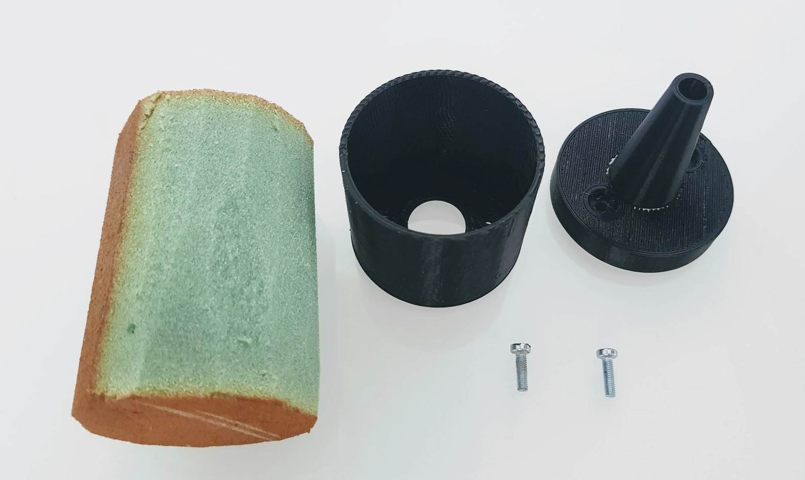
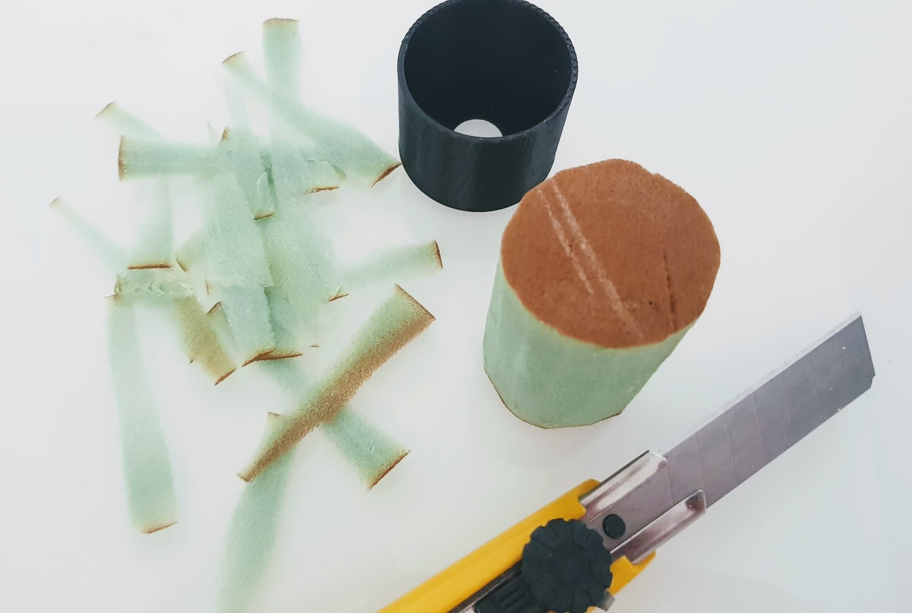
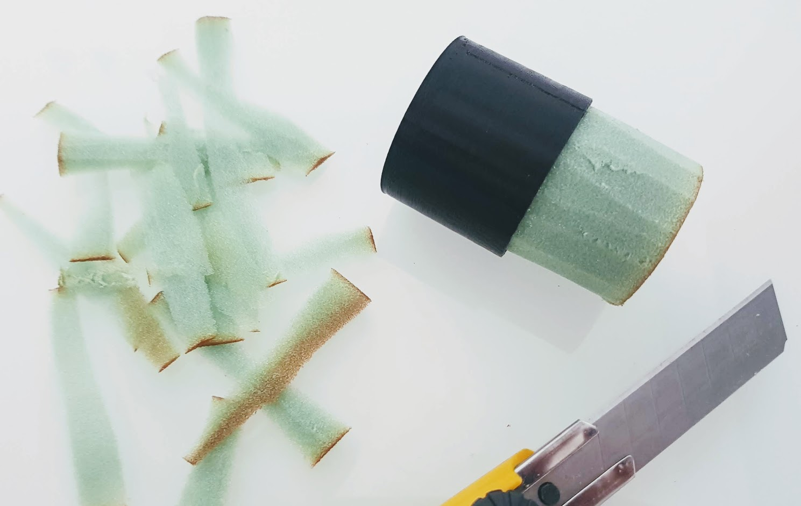
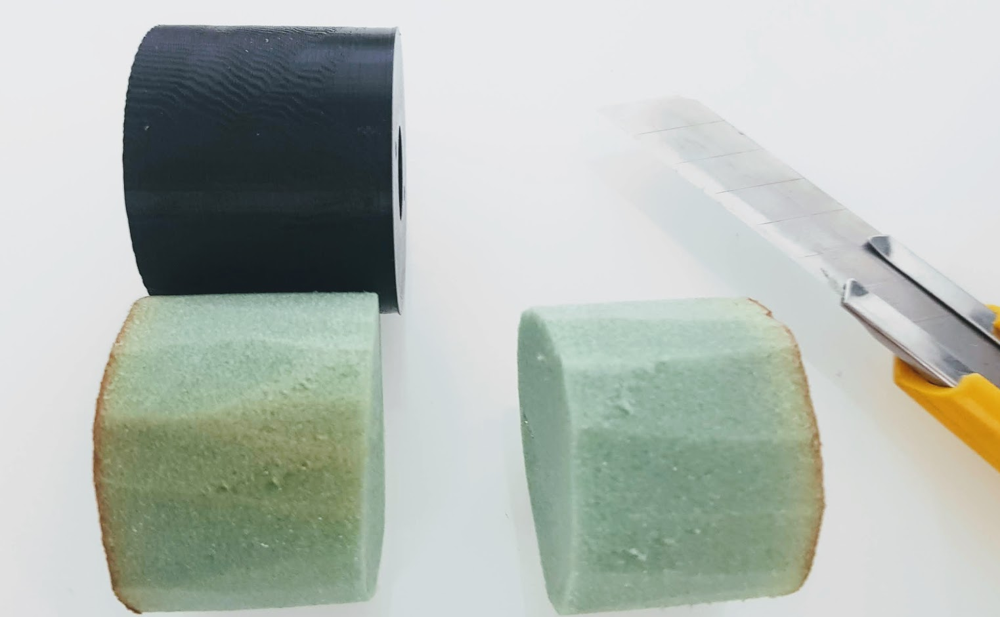
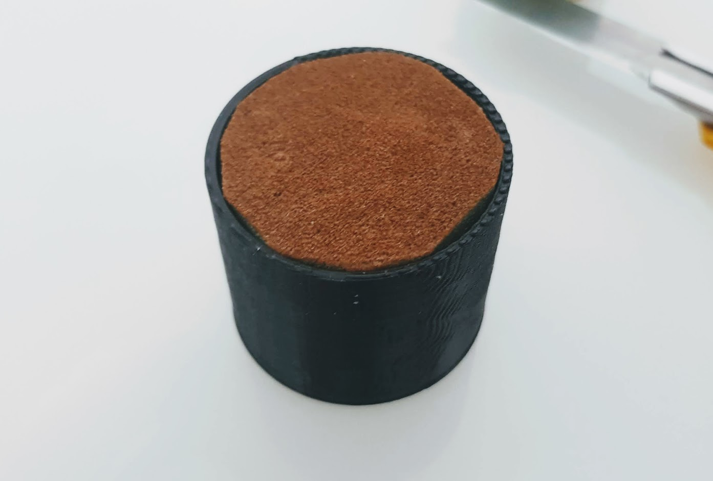
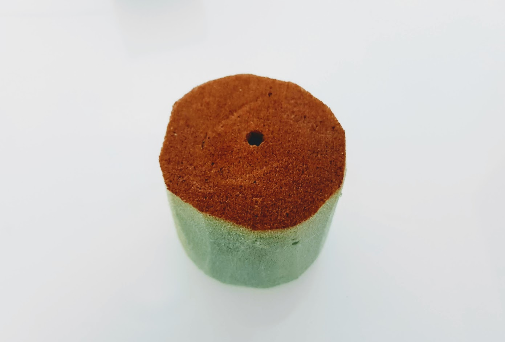
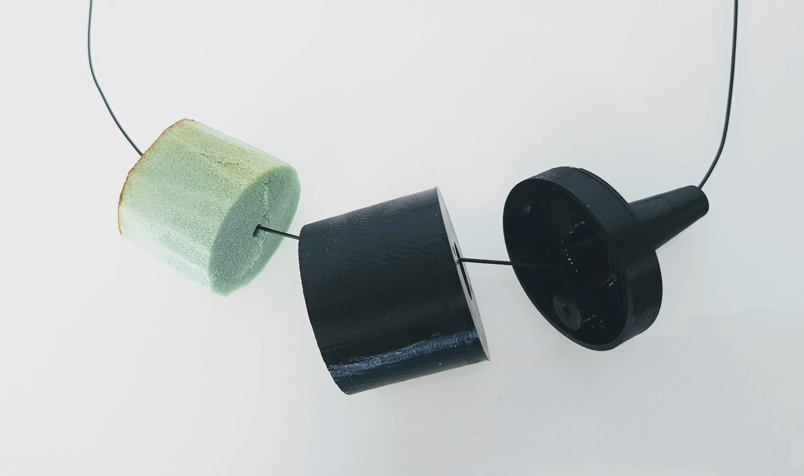

=========
5.5. Boia
=========

5.5.1. Que necessitem?
**********************

5.5.1.1 Material
----------------

*  1x Boia Part A `(Fitxer STL) <https://github.com/r2b2osrov/r2b2-nano/blob/master/design/stl/buoy_top.stl>`_
*  1x Boia Part B `(Fitxer STL) <https://github.com/r2b2osrov/r2b2-nano/blob/master/design/stl/buoy_down.stl>`_
*  2x Cargols M3 16mm
*  Escuma FOAM

5.5.1.2 Eines
-------------

*  Cutter
*  Tornavís

5.5.2 Muntatge
**************

