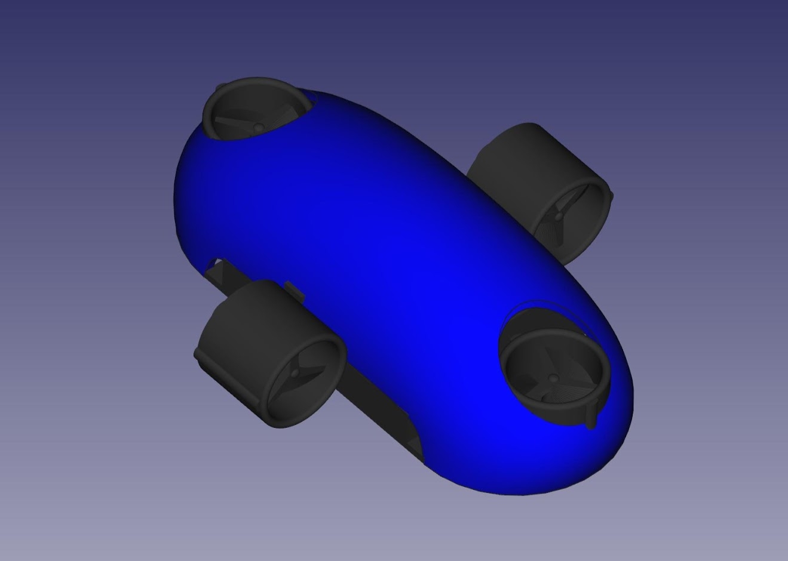
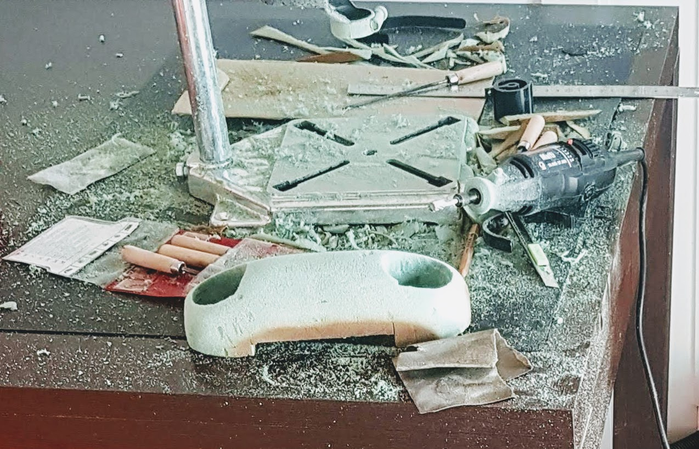

=============
5.6. Carcassa
=============

5.6.1. Que necessitem?
**********************

5.6.1.1 Material
----------------

*  Escuma FOAM
*  `Cola Tèrmica <80_materials.html#cola-temica>`_
*  Massilla de polièster
*  Esprai d'imprimació
*  Esprai pintura

5.6.1.2 Eines
-------------

*  Cutter
*  Trepant amb fresadora
*  Pistola Cola Tèrmica
*  Guants
*  Mascara
*  Ulleres de protecció
*  Llimes/Paper de vidre

5.6.2 Muntatge
**************

El disseny de la carcassa és completament lliure i la seva finalitat està explicada a l'apartat de `Disseny-->Carcassa <../design/index.html#carcassa>`_.

A continuació veurem com s'ha treballat la proposta de carcassa que es motra en la següent imatge.

S'ha agafat un tall d'escuma FOAM i s'ha marcat la línia a seguir per la carcassa.

S'ha anat retallant i buidant amb el cutter i el trepant petit amb la fresadora.

S'ha fet un allisat més fi amb paper de vidre.

S'han fet forat per que no s'hi acomuli aire a entrar dins l'aigua.

.. image:: 60_body_images/60_04_body_assembly.jpg

Finalment s'hi ha fet unes capes d'imprimació i pintura.

