================
5.7. Assamblatge
================

5.7.1. Que necessitem?
**********************

.. warning:: Per poder realitzar el muntatge cal tindre tots els passos anteriors realitzats.

5.7.1.1 Material
----------------

*  2x protecció Port Serie `(Fitxer STL) <https://github.com/r2b2osrov/r2b2-nano/blob/master/design/stl/prog_protec.stl>`_
*  6x Cargols M3x16 Inox
*  6x Volandera M3
*  2x Roca femella M3
*  2x Passador DuPont
*  1x Connector mascle DuPont
*  1x Connector femella DuPont
*  Funda termoretràctil
*  Cola tèrmica
*  Baselina
*  Estany
*  Brides petites

5.7.1.2 Eines
-------------

*  Estenalles d'electrònica
*  Pistola Cola Tèrmica
*  Tornavís 
*  Soldador
 

5.7.2 Muntatge
**************

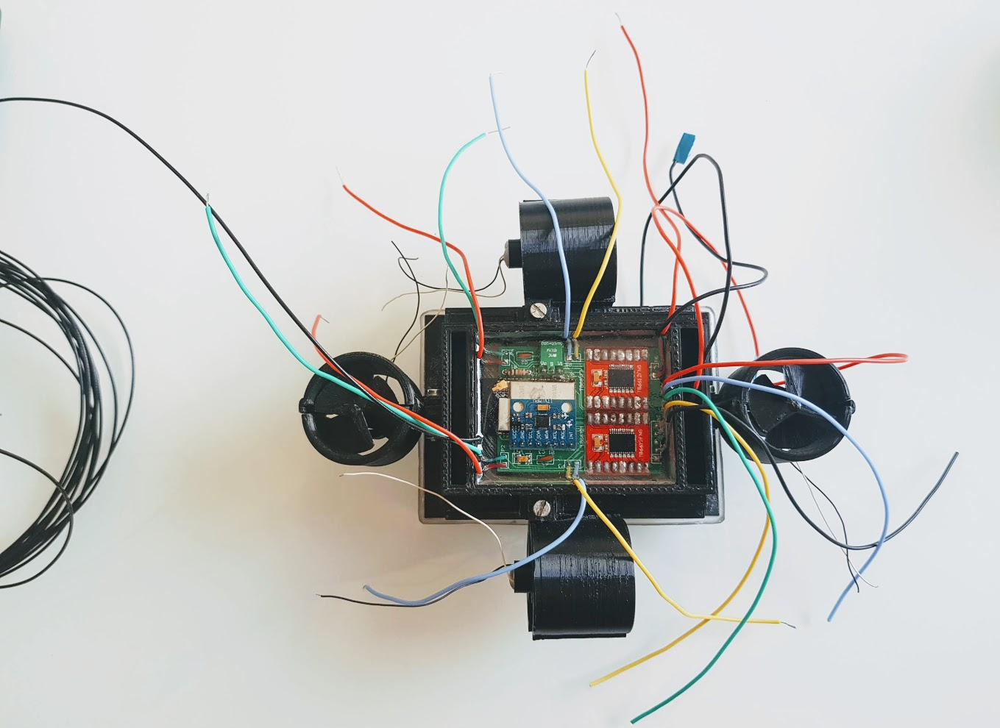
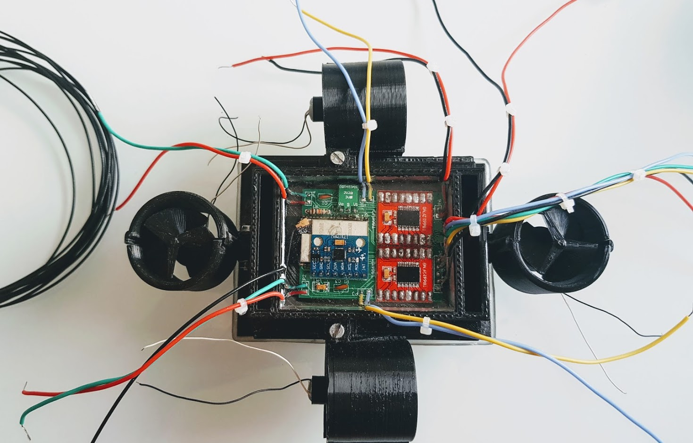
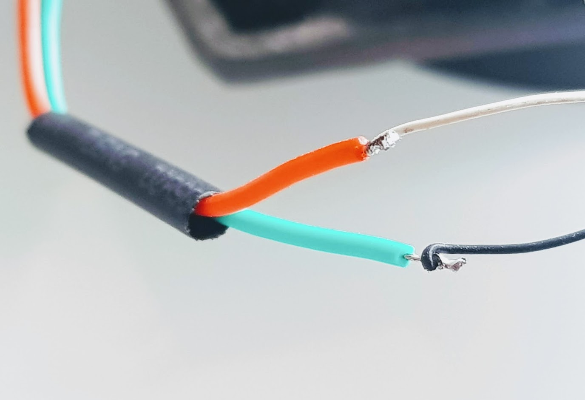
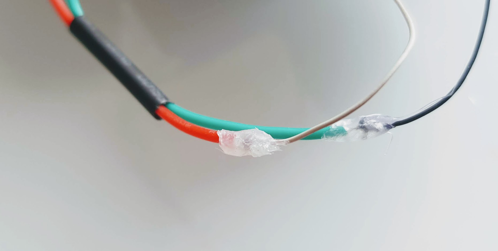
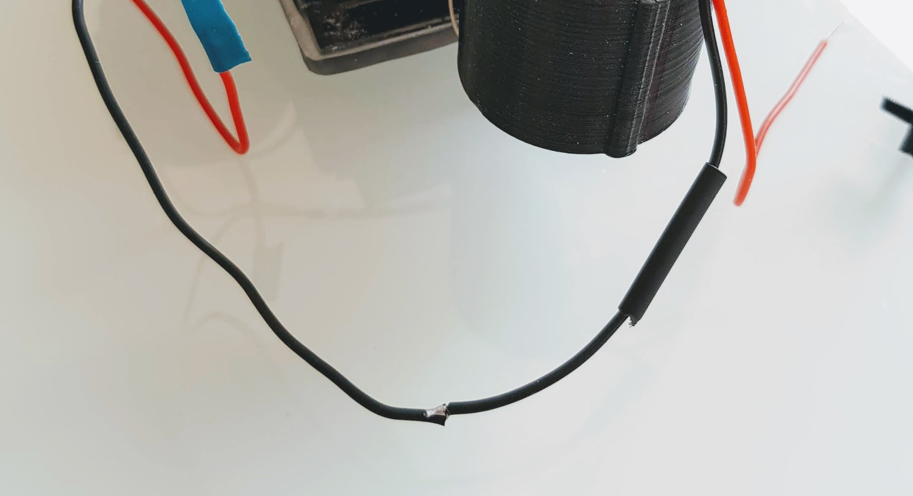
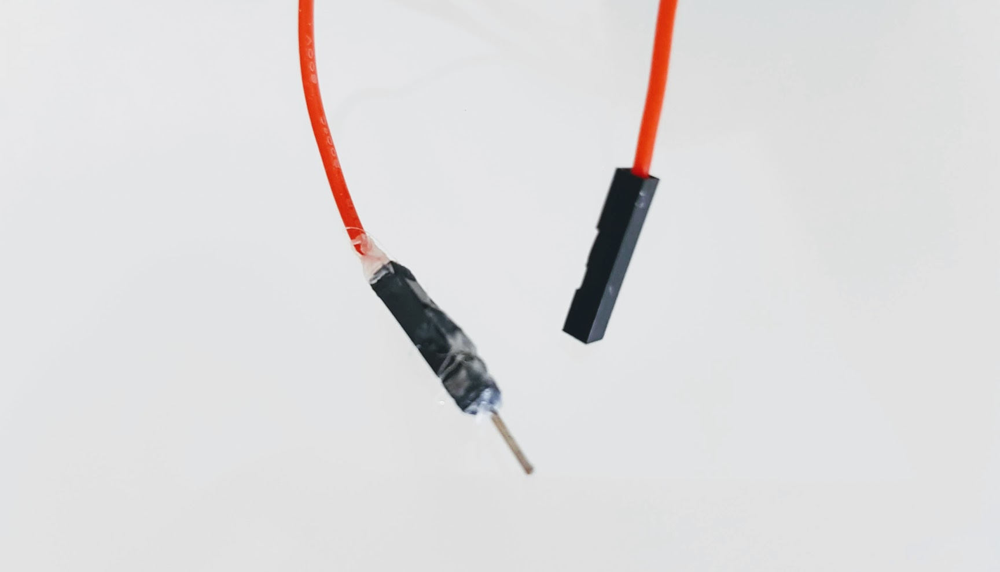
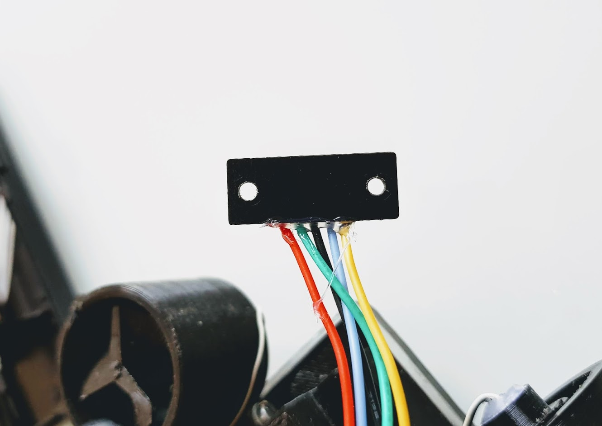
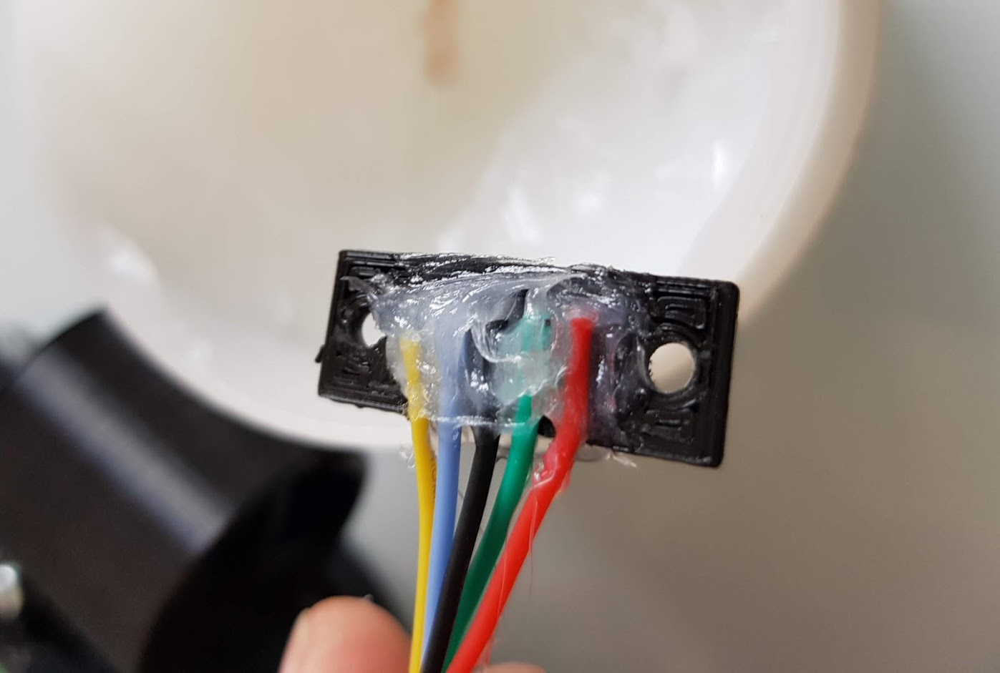
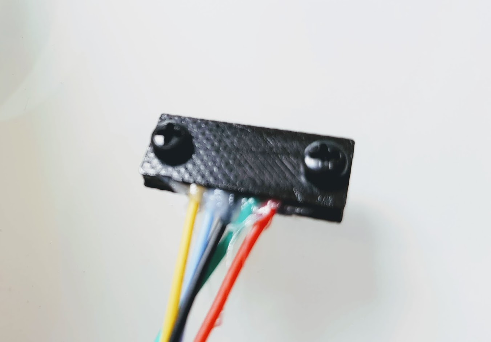
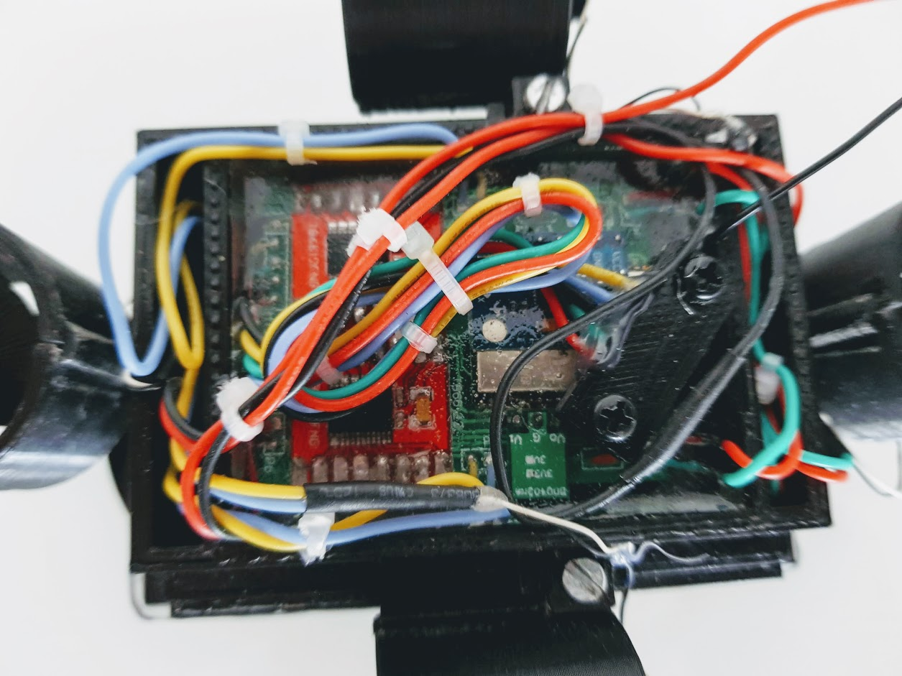
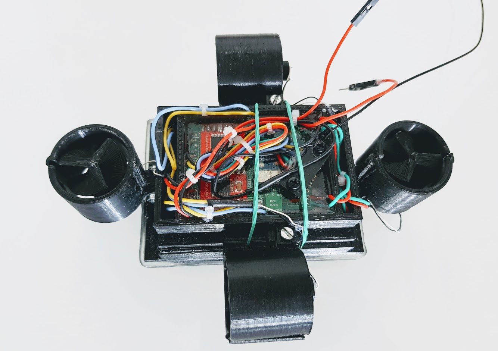
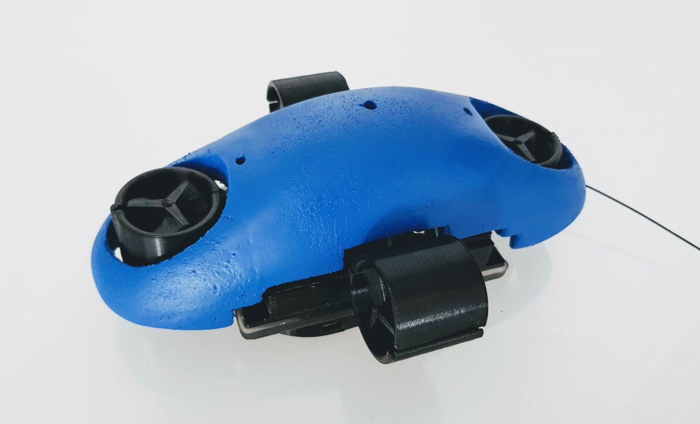