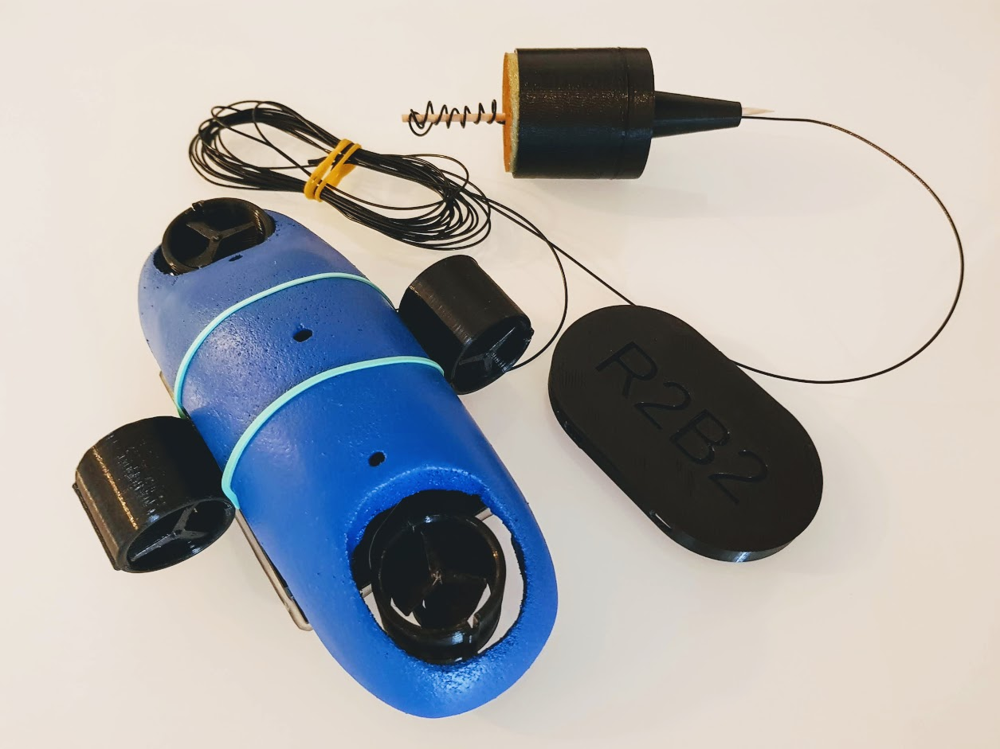

===============
5.7. Acoblament
===============

5.7.1. Que necessitem?
**********************

.. warning:: Per poder realitzar el muntatge cal tindre tots els passos anteriors realitzats.

5.7.1.1 Material
----------------

*  2x `protecció Port Serie <../design/index.html#xassis>`_ `(Fitxer STL) <https://github.com/r2b2osrov/r2b2-nano/blob/master/design/stl/prog_protec.stl>`_
*  4x `Cargols M3x16 Inox <80_materials.html#cargols>`_
*  2x `Cargols M3x6 Inox <80_materials.html#cargols>`_
*  4x `Volandera M3 <80_materials.html#cargols>`_
*  2x `Roca femella M3 <80_materials.html#cargols>`_
*  2x `Passador DuPont <80_materials.html#connectors-dupont>`_
*  1x `Connector mascle DuPont <80_materials.html#connectors-dupont>`_
*  1x `Connector femella DuPont <80_materials.html#connectors-dupont>`_
*  `Funda termoretràctil <80_materials.html#funda-termoretractil>`_
*  `Cola Tèrmica <80_materials.html#cola-temica>`_
*  Baselina
*  `Estany <80_materials.html#estany>`_
*  Brides petites

5.7.1.2 Eines
-------------

*  Estenalles d'electrònica
*  `Pistola Cola Tèrmica <81_tools.html#pistola-de-cola-termica>`_
*  Tornavís 
*  `Soldador <81_tools.html#soldador>`_
 

5.7.2 Muntatge
**************
Si estem en aquest punt vol dir que tenim totes les parts anteriors apunt. Primer agafarem els propulsors i els cargolarem a la base. Per això caldrà fer passar els cables d'alimentació del xassís d'alimentació pel forat que hi ha al xassís de control.

Si ho hem fet tot correctament ens quedarà l'R2B2-nano de la següent manera.

.. image:: 70_assembly_images/70_01_assembly.jpg

Amb brides petites enparellarem els cables que surten de la placa de control i els del xassís d'alimentació per posar una mica d'ordre i poder treballar millor.

.. image:: 70_assembly_images/70_02_assembly.jpg

Per cada parell de cables dels motors hi passarem una funda termoretràctil i llavors soldarem els dos cables als ports dels motors de la placa de control (v0.2: M1, M2, M3 i M4 o v0.1: P2, P3, P4 i P5).

.. image:: 70_assembly_images/70_03_assembly.jpg

Per assegurar-nos de que sigui impermeable i no es curtcircuiti cobrirem les soldadures amb cola tèrmica, llavors hi posarem la funda termoretràctil a sobre i hi aplicarem calor pq s'hi ajusti, però sense excedir-nos ja que podem fondre la cola tèrmica i creuar els cables del motor.

.. image:: 70_assembly_images/70_04_assembly.jpg

Farem el mateix procediment per unir el cable de massa que surt de la base d'alimentació amb el cable de massa del xassís de control. Primer passarem la funda tèrmica, soldarem, recobrirem amb cola tèrmica i taparem amb la funda termoretràctil.

.. image:: 70_assembly_images/70_05_assembly.jpg

Per el cable d'alimentació restant hi muntarem un terminal DuPont mascle i un femella. Així podrem fer servir-lo com a interruptor.

.. image:: 70_assembly_images/70_06_assembly.jpg

Ara els únics cables que ens queden a l'aire són els cables pel port de programació. Com que pràcticament no farem servir aquest port, només si tenim algun problema amb el WiFi o Firmware, l'encapsularem dins el protector del port.

.. image:: 70_assembly_images/70_07_assembly.jpg

Agafarem una de les dues parts de protector del port, l'omplirem de vaselina i hi posarem els cables.

.. image:: 70_assembly_images/70_08_assembly.jpg

Ara agafarem l'altre part del protector i el cargolarem al damunt. Caldrà netejar amb un drap els excedents de vaselina que ens sortiran pels laterals del protector del port.

.. image:: 70_assembly_images/70_09_assembly.jpg

Un cop tenim tots els cables soldats i protegits amb ajuda de cola tèrmica podem anar col·locant tots els cables en ordre.

.. image:: 70_assembly_images/70_10_assembly.jpg

Podem fer servir una goma elàstica per subjectar tots els cables.

.. image:: 70_assembly_images/70_11_assembly.jpg

Ja podem posar la carcassa a sobre. 

.. image:: 70_assembly_images/70_12_assembly.jpg

Per subjectar la carcassa podem fer servir una altre goma elàstica.

