==============
A.1. Materials
==============

A.1.1. Cargols 
--------------

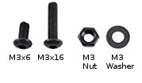

    Cargols, femelles i arandeles M3.

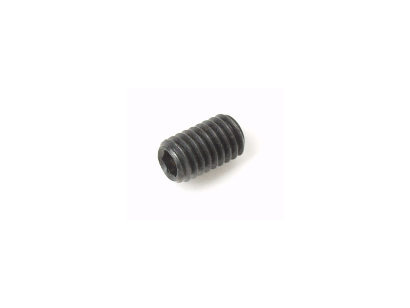

    Cargol sense cap M2x3mm.

A.1.1. Cable Silicona 28AWG 
---------------------------

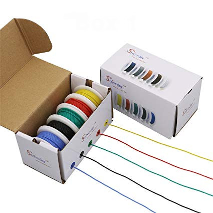

A.1.1. Connectors Dupont 
------------------------

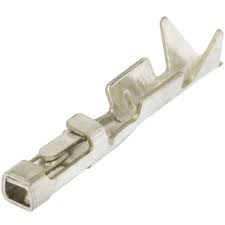

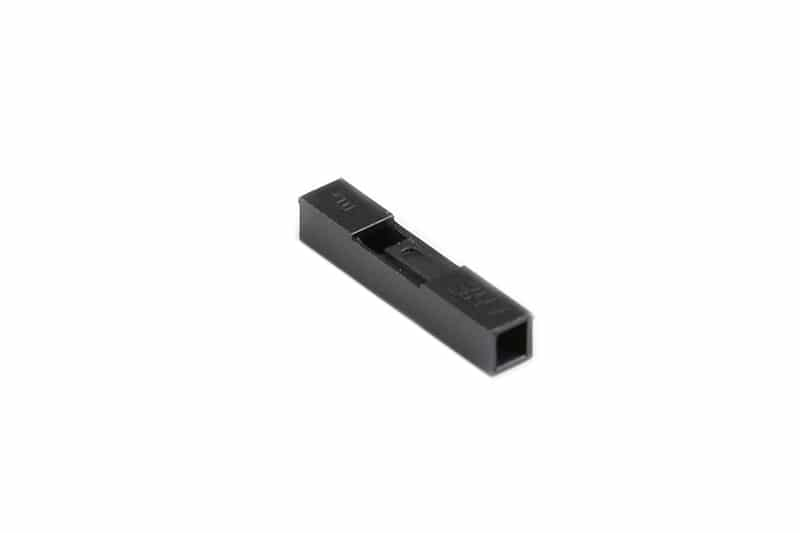

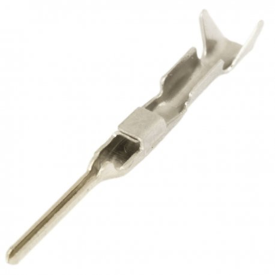

A.1.1. Cable Coaxial 
--------------------

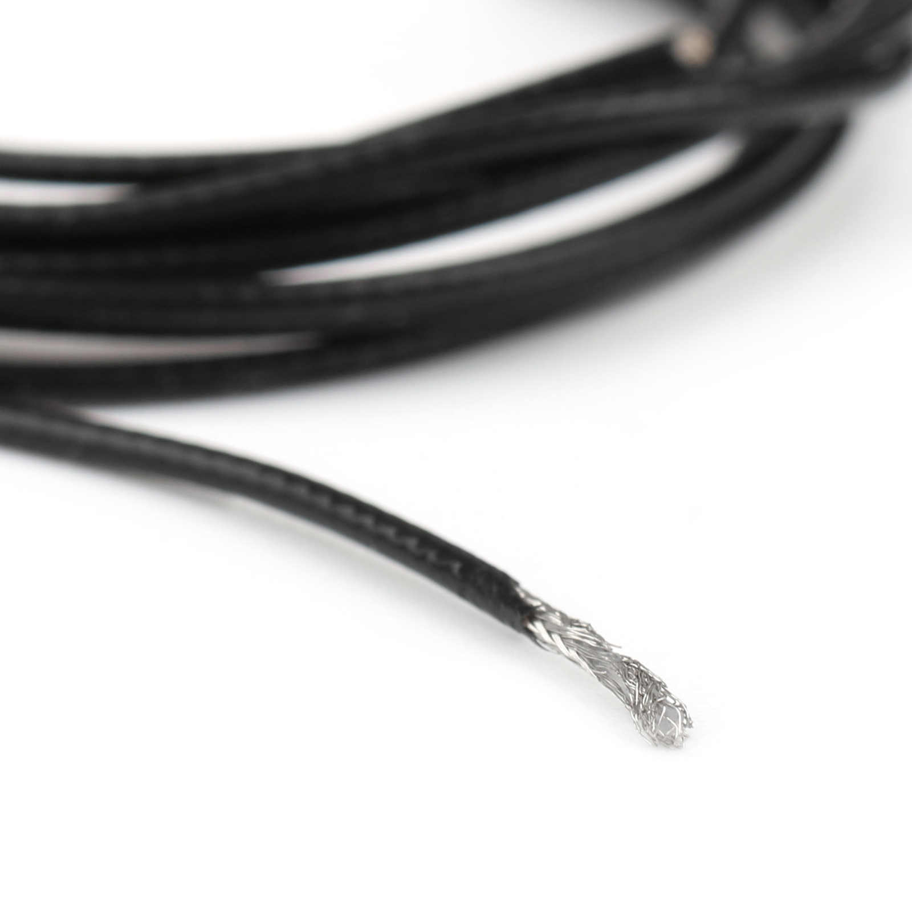

A.1.1. Estany 
-------------

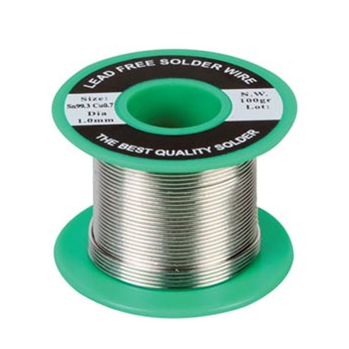

A.1.1. Resina Polièster 
-----------------------

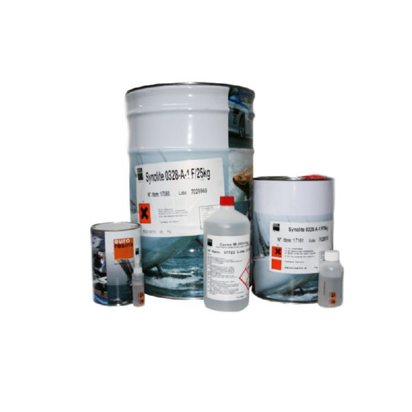

A.1.1. Funda Termoretractil
---------------------------

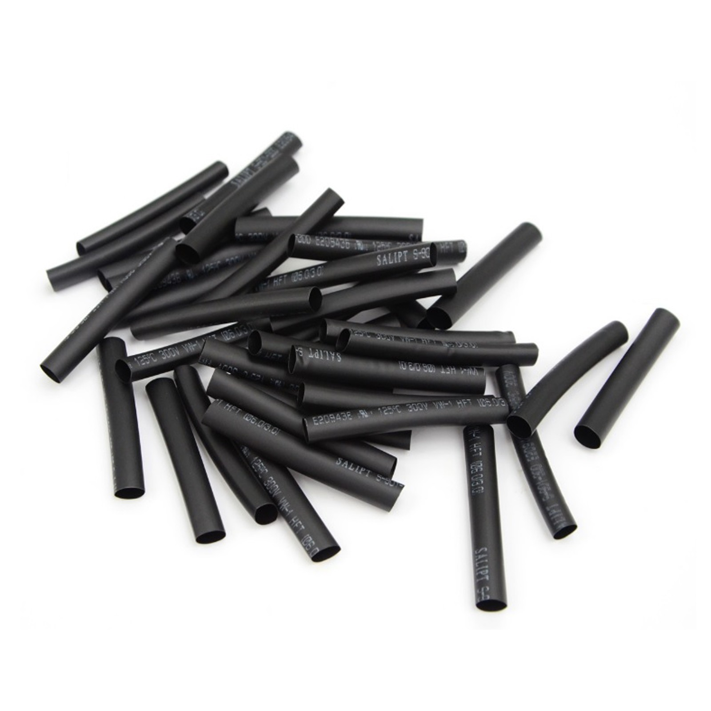

A.1.1. Cola Tèmica 
------------------

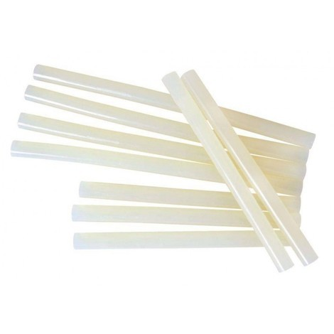
