==========
2. Disseny
==========

El disseny de l'R2B2-nano és completament parametritzable i es pot adaptar ràpidament a les necessitats o dispositius de que es disponin tan sols canviant pocs parametres.

A continuació explicarem com treballar amb el disseny i quins són els parametres que afecten a cada part del disseny.

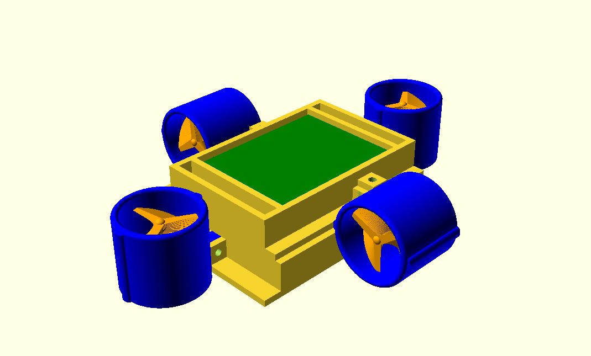

    R2B2-nano 3D (**r2b2-nano.scad**).

2.1. OpenSCAD
*************

El disseny de l'R2B2-nano està realitzat 100% en `OpenSCAD <http://www.openscad.org/>`_. 

OpenSCAD és una aplicació lliure per crear objectes sòlids de CAD. No és un editor interactiu sino un compilador 3D basat en un llenguatge de descripció textual. Un document d'OpenSCAD especifica primitives geomètriques i defineix com son modificades i manipulades per reproduir un model 3D.

Que l'OpenSCAD sigui un llenguatge ens permet per una banda parametritzar tots els objectes de forma molt senzilla i per altra banda ens permet col·laborar d'una manera molt més àgil, ja que la modificació d'un objecte queda reflexada en quina linia de codi s'ha modificat, no en tot un fitxer binari o d'aplicació.

És molt util tindre l'`OpenSCAD CheatSheet <http://www.openscad.org/cheatsheet/index.html>`_ a mà cada cop que volem fer algun disseny o modificació.

2.2. Configuració
*****************

Tots els parametres es troben al fitxer **config.scad** de la carpeta **design**. Podem definir l'amplada de les parets de tot el 3D, les mides del motors, dels propulsors, la mida dels cargols, etc... i cada parametre que ajustem fa que tot el disseny s'hi adapti, així de forma ràpida i sense haver de redibuixar tot el 3D disposem de les peces idònies al nostre muntatge.

A més a més dels parametres que especifiquen les mides del disseny hi ha el paràmetre **$fn** que definex en número de fragments en que es renderitzaran les circumferències completes. Com més gran sigui el valor de $fn més tardarà a fer el renderitzat. No és recomanable un valor superior a 100.

.. code-block:: none

    /*
    Title:          config.scad for R2B2 Nano
    Description:    All configuration parameters for R2B2-Nano
    Authors:        Pau Roura (@proura)
    Date:           20180721
    Version:        0.2
    Notes:
    */

    //General Config
    $fn = 100;
    w_walls=2.7;                //width of the walls
    d_screw_h=3;                //screw thread hole diameter
    d_screw_head=6.5;           //screw head diameter
    d_screw_p=d_screw_h+0.4;    //screw pass trhougth diameter
    h_support=8;                //screw support height
    w_support=8;                //screw support width
    w_chassis=70;               //chassis width
    d_chassis=100;              //chassis depth
    h_battery=12;               //battery height
    h_control=12;               //electronics height

    //motor
    d_motor=7.6;        //motor diameter
    d_motor_shaft=1.5;  //motor shaft diameter
    h_motor=16.60;      //motor height

    //motor_housing
    w_walls_m=1;                           //width of the walls
    gap_housing=3;                         //extra height of the encapsulation
    h_motor_body=h_motor+(gap_housing*2);  //motor housing height

    //Thrusters
    d_motor_t=d_motor+(w_walls_m*2);    //motor support diameter
    h_motor_sup=8;                      //motor support height
    o_motor=0;                          //motor support distance from ground
    d_thruster=34;                      //thruster diameter
    h_thruster=30;                      //thruster height

    //module propeller
    h_propeller=10;     //propeller height
    o_propeller=1;      //offset of the blades to shaft
    n_blade=3;          //number of blades
    s_blade=20;         //angle separation between blades
    w_blade=4;          //width of the blades
    rounded="empty";    //shape of the blades [round | trian | empty]
    d_motor_grub=2;     //motor grub screw diameter

.. centered:: Fitxer config.scad.

2.3. Parts
**********

2.3.1. Base de càrrega
----------------------

La base de càrrega és on hi van les dues bobines transmisores capaces de generear el camp magnètic que un cop connectada amb els USBs a la corrent i posem l'R2B2-nano a sobre ens carregarà les bateries.

La base de càrrega tan sols utilitza com a paràmetres les mides del cargols que volem fer servir. Per tant tan sols comprobarem els següents parametres a la configuració:

.. code-block:: console

    /*
    Title: config.scad for R2B2 Nano
    */

    d_screw_h=3,            //screw hole diameter
    d_screw_p=d_screw_h+0.4 //screw pass trhougth diameter
    d_screw_head=6.5        //screw head diameter

============    =================   ==================================================
Parametre       Valor per defecte   Descripció
============    =================   ==================================================
d_screw_h       3 mm                Diametre de la tija del cargol on ha de collar
d_screw_p       d_screw_h+0.4 mm    Diametre on ha de passar el cargol sense collar 
d_screw_head    6.5 mm              Diametre del cap del cargol
============    =================   ==================================================

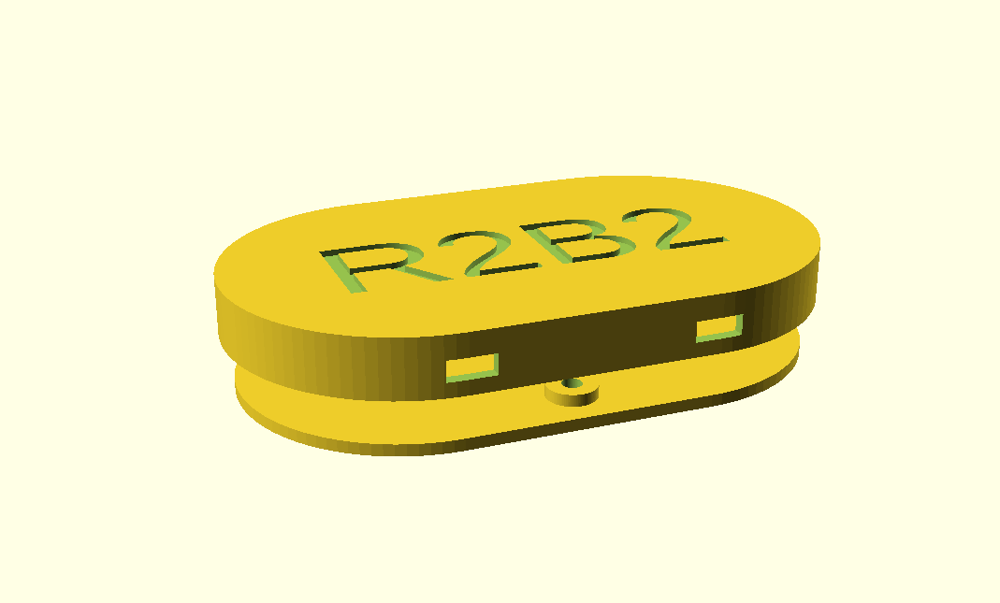

    Base de càrrega (**base.scad**).

2.3.2. Xassís
-------------

El xassís de l'R2B2-nano està format per dues parts. Una on hi ha tot el sistema d'alimentació (bobines receptores de corrent, controladors de càrrega per les bateries, les bateries i el regulador de voltatge) i l'altre on hi ha tota l'electrònica de control (Microcontrolador, el giroscopi/acceleròmetre, drivers de motors, etc...). 

S'ha fet un disseny modular separant l'alimentació del control a proposit, ja que per a aconseguir impermeabilitzar tota l'electrònica somplen els xassís de resina de poliester, que un cop endurida fa que no es pugui accedir a modificar el contingut. El fet de tenir els dos moduls separats fa que podem reaprofitar-los en cas de voler fer modificacions en alguna de les parts.

Els principals paràmetres que cal que tinguem en compte a l'hora de configurar el xassís és l'amplada, la llargada i la profunditat dels dos mòduls per tal d'assegurar-nos que quan fem el bany de resina de poliester l'electrònica quedi totalment coberta.

.. code-block:: console

    /*
    Title: config.scad for R2B2 Nano
    */

    d_screw_h=3,        //screw hole diameter
    w_walls=2.7,        //wall width
    w_support=8,        //support width
    h_support=8,        //support depth
    w_chassis=70,       //chassis width
    d_chassis=100,      //chassis depth
    h_battery=12,       //chassis power height
    h_control=12        //chassis control height

============    =================   ==================================================
Parametre       Valor per defecte   Descripció
============    =================   ==================================================
d_screw_h       3 mm                Diametre de la tija del cargol on ha de collar
w_walls         2.7 mm              Amplada de les parets  
w_support       8 mm                Amplada dels suports del propulsors
h_support       8 mm                Profunditat dels suports del propulsors
w_chassis       70 mm               Amplada del xassís
d_chassis       100 mm              Profunditat del xassís
h_battery       12 mm               Alçada de la zona d'electrònica d'alimentació
h_control       12 mm               Alçada de la zona d'electrònica de control
============    =================   ==================================================

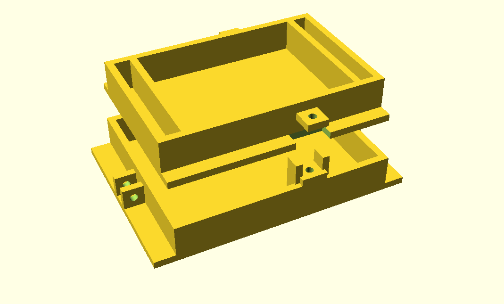

    Xassís d'alimentació i control (**chassis.scad**).
    
L'R2B2-nano es programa a través de Wifi (OTA / Over-the-air programming), però pot ser que algun cop ens trobrem amb problemes, es carregui un firmware erroni i no ens permeti la programació a través de wifi.

Per això és important deixar un port sèrie disponible per poder accedir a programar l'ESP32 amb conversor USB to tty. Aquest port sèrie es compon de 5 cables i mentre no es fan servir cal que estiguin protegits per no crear curtcircuits. Els cables que componen el port es col·loquen dins el protector del port i es farceix de vaselina per que no hi pugui entrar l'aigua.

L'únic paràmtre que hem de tenir en compte és la mida del cargols que farem servir per collar el protector.

.. code-block:: console

    /*
    Title: config.scad for R2B2 Nano
    */

    d_screw_h=3 //screw hole diameter

============    =================   ==================================================
Parametre       Valor per defecte   Descripció
============    =================   ==================================================
d_screw_h       3 mm                Diametre de la tija del cargol on ha de collar
============    =================   ==================================================

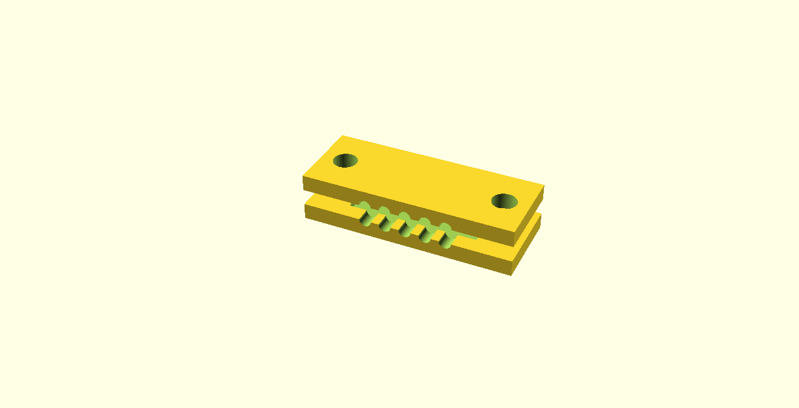

    Protecció pel port sèrie (**prog_protect.scad**).

2.3.3. Propulsors
-----------------

l'R2B2-nano esrà format per 4 propulsors que es componen de 3 parts: Carcassa del propulsor, carcassa del motor i hèlix.

La carcassa dels propulsors ens serveix per collar els motors al xassís i per evitar que l'hèlix pugui col·lisionar amb qualsevol objecte quan el motor està en marxa. Els principals parametres que cal tenir en compte son les mides del motor. 

A continuació detallem quins paràmetres de la configuració afecten al propulsor:

.. code-block:: console

    /*
    Title: config.scad for R2B2 Nano
    */

    d_screw_p=3.4,                      //screw diameter
    w_walls=2.7,                        //width of the walls
    w_support=8                         //screw support width
    h_support=8,                        //screw support height
    w_walls_m=1,                        //width of the motor encapsulation walls
    d_motor_t=d_motor+(w_walls_m*2),    //motor diameter
    h_motor_sup=8,                      //motor support height
    o_motor=0,                          //motor support distance from ground
    d_thruster=34,                      //thruster diameter
    h_thruster=30,                      //thruster height

============    =========================  ==================================================
Parametre       Valor per defecte          Descripció
============    =========================  ==================================================
d_screw_h       3 mm                       Diametre de la tija del cargol on ha de collar
w_walls         2.7 mm                     Amplada de les parets  
w_support       8 mm                       Amplada dels suports del propulsors
h_support       8 mm                       Profunditat dels suports del propulsors
w_walls_m       1 mm                       Parets de la carcassa del motor
d_motor_t       d_motor+(w_walls_m*2) mm   Diametre total del motor (motor + carcassa)
h_motor_sup     8 mm                       Alçada del cos del motor
o_motor         0 mm                       Offset del suport respecte la base del propulsor
d_thruster      34 mm                      Diametre del propulsor
h_thruster      30 mm                      Alçada del propulsor
============    =========================  ==================================================

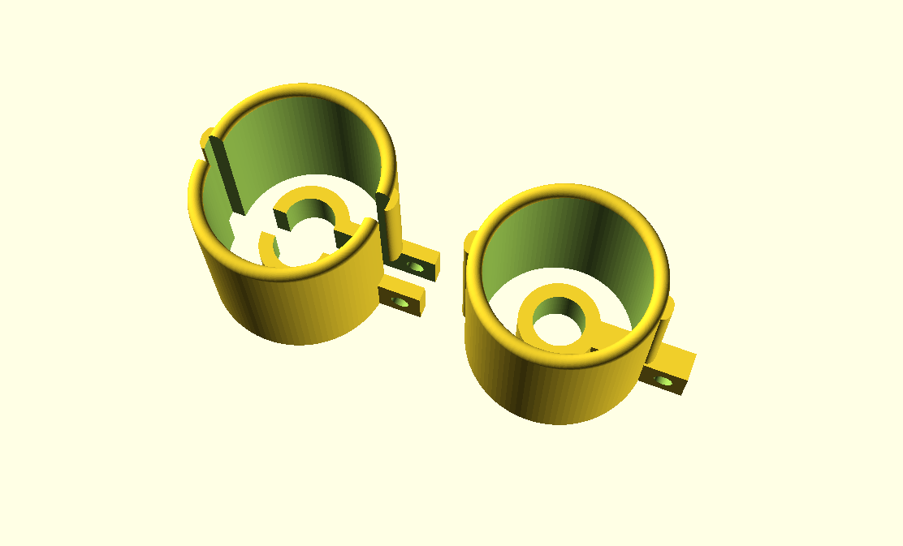

    Propulsor (**thruster.scad**).

La carcassa del motor ens serveix per aillar els motors de l'aigua. Els principals parametres que hem de tenir en compte son les mides dels motors que volem fer servir i l'amplada de les paret de la carcassa, que amb un valor petit ja serà suficien ja que no ha d'aguntar càrrega mecanica, tan sols aillar de l'aigua. Per l'amplada de l'eix del motor sempre va bé deixar una mica més de la mida real, sino a l'hora del muntatge haurem de repassar els forats amb un trepant. I per a l'alçada de la carcassa deixar un milimetres extres respecte a l'alçada del motor per tal de poder-hi posar la cola tèrmica.

.. code-block:: console

    /*
    Title: config.scad for R2B2 Nano
    */

    w_walls_m=1,        //width of the walls
    d_motor=7.6,        //motor diameter
    h_motor_body=22.6,  //motor housing height
    d_motor_shaft=1.5   //motor shaft diameter

        
=============   =================   ==================================================
Parametre       Valor per defecte   Descripció
=============   =================   ==================================================
w_walls_m       1 mm                Amplada de les parets de la carcassa
d_motor         7.6 mm              Diametre del motor  
h_motor_body    22.6 mm             Alçada de l'encapsulat del motor
d_motor_shaft   1.5 mm              Amplada de l'eix del motor
=============   =================   ==================================================

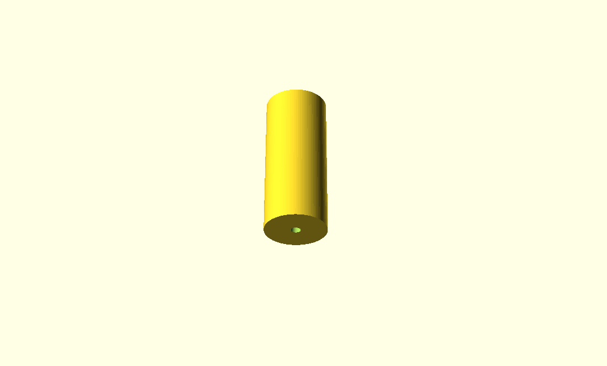

    Encapsulat del motor (**motor_housing.scad**).

En aquest objecte 3D s'ha tingut més en compte que s'ha de poder imprimir amb una impressora 3D que la seva eficiència. Per tant s'han fet unes hèlix no gaire primes i amb una forma molt recta per facilitar la impressió. No hi ha cap parametre destacable a part de escollir la quantitat d'aspes i la seva disposició ja que la majoria de parametres que l'afecten ja estan determinat per la mida del propulsor i del motor descrits anteriorment.

.. code-block:: console

    /*
    Title: config.scad for R2B2 Nano
    */

    w_walls=2.7,        //width of the walls
    d_thruster=34,      //thruster diameter
    h_propeller=10,     //propeller height
    o_propeller=1,      //distance from propeller to walls of thruster
    n_blade=3,          //number of blades
    s_blade=20,         //angle separation between blades
    w_blade=4,          //width of the blades
    rounded=false,      //shape of the blades [round | trian | empty]
    d_motor_shaft=1.5,  //motor shaft diameter
    d_motor_grub=2      //motor grub screw diameter

=============   =================   ==================================================
Parametre       Valor per defecte   Descripció
=============   =================   ==================================================
w_walls         2.7 mm              Amplada de les parets 
d_thruster      34 mm               Diametre del propulsor
h_propeller     10 mm               Alçada del propulsor
o_propeller     1 mm                Espai entre l'hèlix i les parets del propulsor
n_blade         3 mm                Nombre d'aspes a l'hèlix
s_blade         20 mm               Espai buit entre aspes en º
w_blade         4 mm                Amplada de les parets de les aspes
rounded         false               Forma de les aspes [round | trian | empty]
d_motor_shaft   1.5 mm              Amplada de l'eix del motor
d_motor_grub    2 mm                Diametre del cargol sense cap per collar l'hèlix
=============   =================   ==================================================

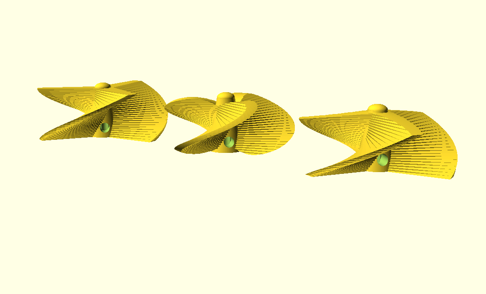

    Hèlix (**propeller.scad**).

2.3.4. Boia
-----------

Una de les majors complicacion que es presenten en un ROV són les comunicacions, degut a que l'aigua no és un medi amic de les altes freqüencies que utilitzen el Wifi o el Bluetooth. Per això es deu qué la majoria de ROVs duen un cable fins a la superfície, ja sigui per emetre les ones de communicació com per conectar directament a la consola de control.

Com a parametres a la boia nomes hi ha les mides del cargols que utilitzarem per unir-ne les dues parts.

.. code-block:: console

    /*
    Title: config.scad for R2B2 Nano
    */

    d_screw_h=3,            //screw hole diameter
    d_screw_head=6.5        //screw head diameter

============    =================   ==================================================
Parametre       Valor per defecte   Descripció
============    =================   ==================================================
d_screw_h       3 mm                Diametre de la tija del cargol on ha de collar
d_screw_head    6.5 mm              Diametre del cap del cargol
============    =================   ==================================================

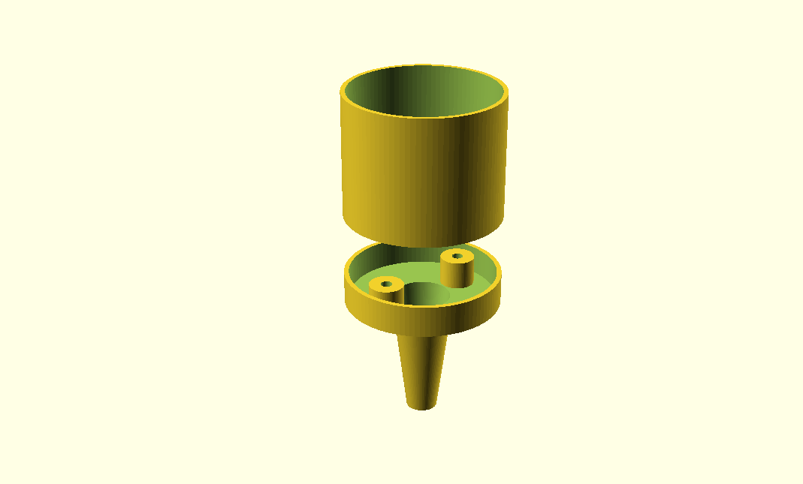

    Boia (**buoy.scad**).

2.3.5. Carcassa
---------------

La carcassa **NO ÉS IMPRIMIBLE** en 3D!!! Està feta a mà amb espuma FOAM o alguna altre espuma que es pugui moldejar fàcilment amb un cuter, un trepan petit amb una fresa, llimes... 

La seva funció principal és aconseguir la flotabilitat zero de l'R2B2-nano, és a dir que un cop col·loquen la carcassa a l'R2B2-nano i el submergim sota l'aigua ni s'enfonsi ni floti cap a la superficie.

.. note:: Sempre va bé deixar una mica de flotabilitat positiva per que l'R2B2-nano vagi cap a la superficie en el cas de que ens quedem sense bateria o es produeix algun error de communicacions.

Per tan la carcassa de R2B2-nano és pot fer al gust i forma de cadascú tinguent en compte els principis d'Arquímedes. Si fem una forma de carcassa assimètrica, l'eix que es crea entre el punt de flotació i el punt de pes farà que l'R2B2-nano s'estabilitzi en una posició incòmode i de més dificil controlar.

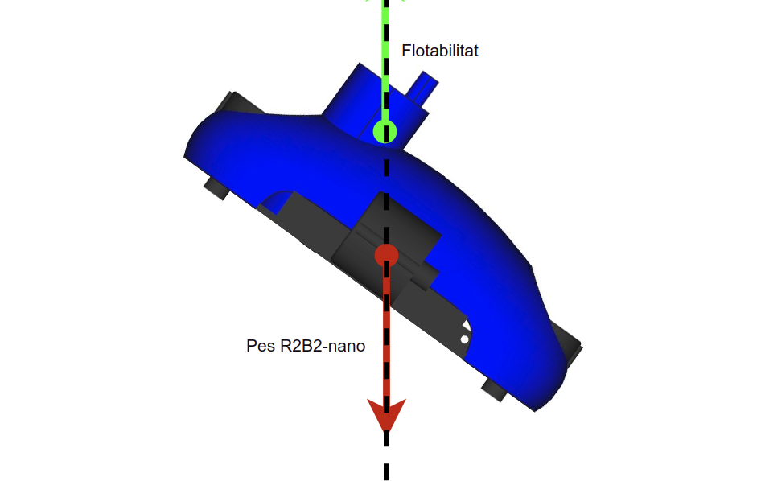

    Disseny mala carcassa.

Per altra banda si aconseguim alinear tan la flotació com el pes de l'R2B2-nano en una posició on ens queden tots els propulsors a la mateixa alçada, tindrem un R2B2-nano molt més estable i fàcil de controlar.

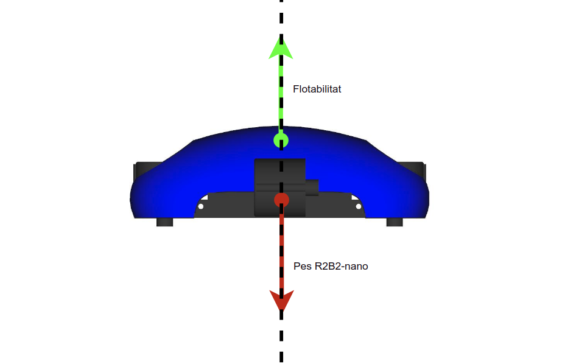

    Disseny carcassa correcte.

Una proposta de carcassa podria ser com la mostrada a continuació:    

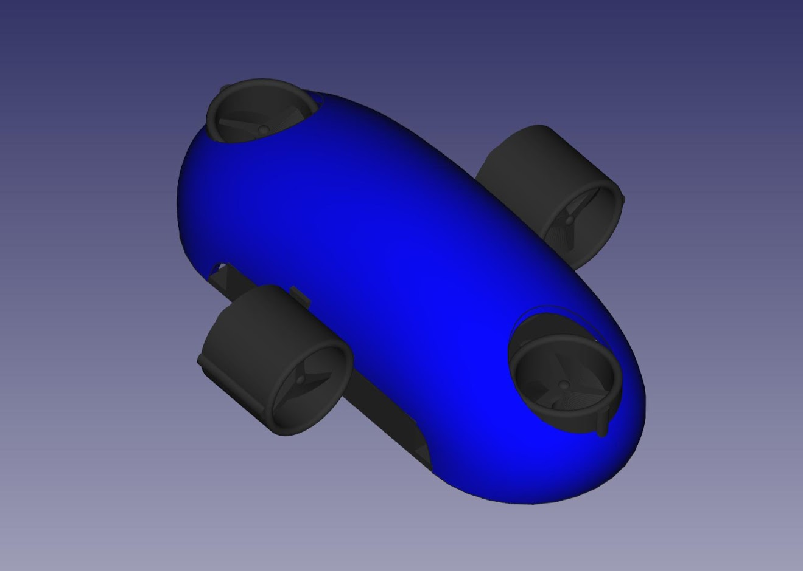

    Proposta de carcassa.

2.4. Generar STL
****************

Per poder imprimir les peces en una impressora 3D convencional cal que els fitxers estiguin en un format compatible com pot ser STL. Des de l'OpenSCAD podem generar els fitxers STL un a un, però per agilitzar aquesta tasca hi ha un Script dins la carpeta design que recorre el contingut de la carpeta **/to_stl** i converteix cada fitxer .scad que hi troba a un STL. Els STLs generats es desen a la carpeta **/stl**.

.. Attention:: Generar tots el fitxers pot requerir una espera llarga. 

.. code-block:: console

    r2b2@r2b2os:/r2b2-nano/design$ ./generate_stl.sh 
    Converting base_b.scad to base_b.stl
    Converting base.scad to base.stl
    Converting buoy_down.scad to buoy_down.stl
    Converting buoy_top.scad to buoy_top.stl
    Converting chassis_b.scad to chassis_b.stl
    Converting chassis.scad to chassis.stl
    Converting half_thruster_A.scad to half_thruster_A.stl
    Converting half_thruster_B.scad to half_thruster_B.stl
    Converting motor_housing.scad to motor_housing.stl
    Converting prog_protec.scad to prog_protec.stl
    Converting propeller.scad to propeller.stl
    Converting r2b2_nano.scad to r2b2_nano.stl

Per altra banda, si nomes ens ens interessa regenerar l'STL d'una sola peça, podem cridar l'script passant com a paràmetre el nom .scad del fitxer que volem convertir.

.. code-block:: console

    r2b2@r2b2os:/r2b2-nano/design$ ./generate_stl.sh to_stl/propeller.scad