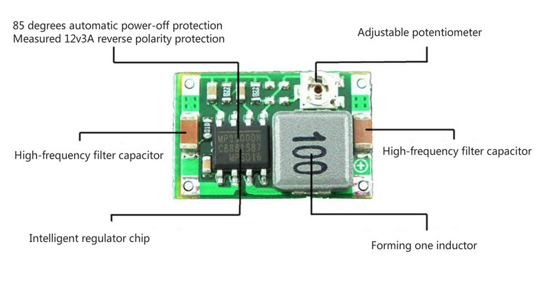

==============
3. Electrònica
==============

3.1. Alimentació
****************

Es pot trobar l'esquema electronic "r2b2-nano-power" al projecte públic `R2B2-nano <https://easyeda.com/r2b2osrov/r2b2-nano>`_ allotjat a EASEYEDA.

.. image:: 10_power/10_01_power_schematic.png
    :align: center

3.2. Control
************

Es pot trobar l'esquema electronic "r2b2-nano-board" al projecte públic `R2B2-nano <https://easyeda.com/r2b2osrov/r2b2-nano>`_ allotjat a EASEYEDA.

.. image:: 20_control/20_01_control_schematic.png
    :align: center
.. image:: 20_control/20_02_control_ESP32_PINOUT.jpg
    :align: center

3.3. Components
***************

.. _ref-ESP32:

3.3.1. ESP32-WROVER-I (Espressif)
---------------------------------

.. image:: 30_components/30_01_components_ESP32-WROVER.jpg
    :align: center

ESP32 is a single 2.4 GHz Wi-Fi-and-Bluetooth combo chip designed with the TSMC ultra-low-power 40 nm technology. It is designed to achieve the best power and RF performance, showing robustness, versatility and reliability in a wide variety of applications and power scenarios.

3.3.2. MPU-6050 (InvenSense)
----------------------------

The MPU-6050™ parts are the world’s first MotionTracking devices designed for the low power, low cost, and high-performance requirements of smartphones, tablets and wearable sensors.

The MPU-6050 incorporates InvenSense’s MotionFusion™ and run-time calibration firmware that enables manufacturers to eliminate the costly and complex selection, qualification, and system level integration of discrete devices in motion-enabled products, guaranteeing that sensor fusion algorithms and calibration procedures deliver optimal performance for consumers.

The MPU-6050 devices combine a 3-axis gyroscope and a 3-axis accelerometer on the same silicon die, together with an onboard Digital Motion Processor™ (DMP™), which processes complex 6-axis MotionFusion algorithms. The device can access external magnetometers or other sensors through an auxiliary master I²C bus, allowing the devices to gather a full set of sensor data without intervention from the system processor. The devices are offered in a 4 mm x 4 mm x 0.9 mm QFN package.

.. image:: 30_components/30_01_components_MPU-6050.png
    :align: center

The InvenSense MotionApps™ Platform that comes with the MPU-6050 abstracts motion-based complexities, offloads sensor management from the operating system, and provides a structured set of APIs for application development.

For precision tracking of both fast and slow motions, the parts feature a user-programmable gyro full-scale range of ±250, ±500, ±1000, and ±2000 °/sec (dps), and a user-programmable accelerometer full-scale range of ±2g, ±4g, ±8g, and ±16g. Additional features include an embedded temperature sensor and an on-chip oscillator with ±1% variation over the operating temperature range.

Link oficial `MPU-6050 <https://www.invensense.com/products/motion-tracking/6-axis/mpu-6050/>`_ 

.. image:: 30_components/30_02_components_MPU-6050.jpg
    :align: center

3.3.3. TB6612FNG (Thosiba)
--------------------------

.. image:: 30_components/30_02_components_TB6621FNG.jpg
    :align: center

TB6612FNG is a driver IC for DC motor with output transistor in LD MOS structure with low ON-resistor. Two input signals, IN1 and IN2, can choose one of four modes such as CW, CCW, short
brake, and stop mode.

.. image:: 30_components/30_01_components_TB6621FNG.png
    :align: center

3.3.4. TP4056 & DW01A
---------------------

The TP4056 is a complete constant-current/constant-voltage linear charger for single cell lithium-ion batteries. Its SOP package and low external component count make the TP4056 ideally suited for portable applications. Furthermore, the TP4056 can work within USB and wall adapter.

The DW01A battery protection IC is designed to protect lithium-ion/polymer battery from damage or degrading the lifetime due to overcharge, overdischarge, and/or overcurrent for one-cell lithium-ion/polymer battery powered systems, such as cellular phones.

.. image:: 30_components/30_01_components_Battery_module.jpg
    :align: center
.. image:: 30_components/30_02_components_Battery_module.jpg
    :align: center

3.3.5 Cargador Qi i Receptor Qi
-------------------------------

.. image:: 30_components/30_01_components_Qi_charger.jpg
.. image:: 30_components/30_01_components_Qi_receiver.jpg

3.3.6 Bateria Lipo
------------------

.. image:: 30_components/30_01_components_Battery_LIPO.jpg

3.3.7 Reguladors de Voltatge
----------------------------

.. image:: 30_components/30_02_components_V_reg.jpg

