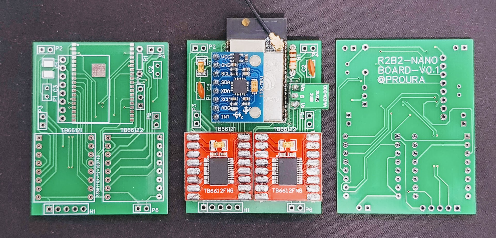
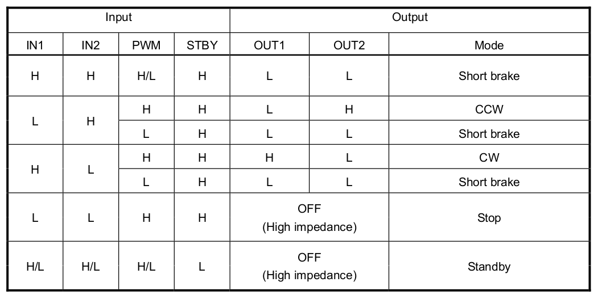

==============
3. Electrònica
==============

L'R2B2-nano consta de dos mòduls. Un es l'encarregat de suplir corrent elèctrica, tan a motors com a components electrònics, i l'altre de controlar els dispositus i les comunicacions.

Els esquemes i PCB dels dos mòduls estan en un projecte públic de la web EasyEDA anomentat `R2B2-nano <https://easyeda.com/r2b2osrov/r2b2-nano>`_.

3.1. Alimentació
****************

La base d'alimentació està formada per dues `bateries LIPO <#bateria-lipo>`_ de 3.7 volts connectades en sèrie arribant a un total de 7.4 volts. Cadascuna d'aquestes dues bateries està connectada a un `mòdul de càrrega TP4056 <#tp4056-dw01a>`_ que a més a més de gestionar la càrrega les protegeix tan de sobrecàrregues com de infracàrregues. El mòdul de càrrega TP4056 disposa d'un port USB com a entrada de corrent, però per evitar connectors amb possible contacte amb l'aigua s'ha optat per posar un receptor de corrent sense fils (`Qi Receiver <#cargador-qi-i-receptor-qi>`_).

Per ajustar la sortida de voltage als requeriments del mòdul de control s'ha connectat un `Regulador de Voltatge <#reguladors-de-voltatge>`_ a la sortida de les dues bateries en sèrie. 

3.2.1. Esquemàtics
------------------

Es pot trobar l'esquema electronic "r2b2-nano-power" al projecte públic `R2B2-nano <https://easyeda.com/r2b2osrov/r2b2-nano>`_ allotjat a EasyEDA.

.. figure:: 10_power/10_01_power_schematic.png
    :align: center

    Esquema del mòdul d'alimentació.

3.2.2. Muntatge
----------------

Podeu veure com muntar aquest mòdul a l'apartat `Xassís Alimentació <../assembly/20_power.html>`_

.. figure:: ../assembly/20_power_images/20_21_power_assembly.jpg
    :align: center

    Mòdul d'alimentació en construcció.

3.2. Control
************

El mòdul de control de l'R2B2-nano és l'encarregat de comunicar-se amb l'exterior i transmetre les ordres sol·licitades als diferents components. Té com a microntrolador un `ESP32 WROVER <#esp32-wrover-i-espressif>`_ que incorpora WiFi/Bluetooth i a través d'un connector coaxial ens permet treure un cable fins a la superfície per a realitzar les comunicacions.

Disposem de dos controladors de motors `TB6612FNG <#tb6612fng-thosiba>`_ que ens permet controlar a través de modulació per amplada de polsos (PWM) fins a 4 dispositus, en el nostre cas els motors dels propulsors. 

També disposa d'un giroscopi i accelerometer `MPU 6050 <#mpu-6050-invensense>`_ que ens pot enviar informació del posicionament que té l'R2B2-nano en cada moment i realitzar les operacions que es creguin oportunes.

Tots els dispositius que hi ha al mòdul de control funcionen a 3.3 volts, per tant ens cal un `Regualdor <#reguladors-de-voltatge>`_ per rebaixar el voltage que ens proporciona el mòdul d'alimentació als 3.3 volts.

3.2.1. Esquemàtics
------------------

Es pot trobar l'esquema electronic "r2b2-nano-board" al projecte públic `R2B2-nano <https://easyeda.com/r2b2osrov/r2b2-nano>`_ allotjat a EasyEDA.

.. figure:: 20_control/20_01_control_schematic.png
    :align: center

    Esquema del mòdul de control.

3.2.2. Muntatge 
---------------

Per a muntar el mòdul de control hi ha varies opcions: 

*  Es pot cablejar sobre els mateixos components com es motra a la següent imatge. Això ens pot servir per fer un prototip, però no es recomanable ja que és molt fàcil comtre errors o que se'ns malmetin les soldadures al manipular la placa.

    Mòdul de control sense placa PCB.

*  A la web del projecte R2B2-nano de EasyEDA hi ha disponible dos disseny de placa PCB una amb els components SMD (Surface-mount device) i l'altre amb components convencionals.

    Placa PCB del mòdul de control.

    Placa PCB del mòdul de control amb SMD (Surface-mount device).

Podeu veure com muntar aquest mòdul a l'apartat `Xassís Control <../assembly/30_control.html>`_

    Mòdul de control muntat.

3.2.3 Connexions ESP32
----------------------

Al l'equema següent podem veure que hi ha connectat a cada port de l'EPS23 WROVER. 

    Connexions de l'ESP32.

Relació entre els drivers de motors i els ports de la placa:

=========== ======= ======== ========
Driver      Sortida PCB v0.1 PCB v0.2
=========== ======= ======== ========
TB6612FNG_1 Out A   P2       M1 
TB6612FNG_1 Out B   P3       M2 
TB6612FNG_2 Out A   P4       M3 
TB6612FNG_2 Out B   P5       M4   
=========== ======= ======== ========

3.3. Components
***************

3.3.1. ESP32-WROVER-I (Espressif)
---------------------------------

    ESP32 WROVER.

ESP32 is a single 2.4 GHz Wi-Fi-and-Bluetooth combo chip designed with the TSMC ultra-low-power 40 nm technology. It is designed to achieve the best power and RF performance, showing robustness, versatility and reliability in a wide variety of applications and power scenarios.

*  Link oficial a `Espressif ESP32 <https://www.espressif.com/en/products/hardware/esp32/overview>`_.

3.3.2. MPU-6050 (InvenSense)
----------------------------

.. figure:: 30_components/30_02_components_MPU-6050.jpg
    :align: center

    Mòdul MPU-6050.

The MPU-6050™ parts are the world’s first MotionTracking devices designed for the low power, low cost, and high-performance requirements of smartphones, tablets and wearable sensors.

The MPU-6050 incorporates InvenSense’s MotionFusion™ and run-time calibration firmware that enables manufacturers to eliminate the costly and complex selection, qualification, and system level integration of discrete devices in motion-enabled products, guaranteeing that sensor fusion algorithms and calibration procedures deliver optimal performance for consumers.

The MPU-6050 devices combine a 3-axis gyroscope and a 3-axis accelerometer on the same silicon die, together with an onboard Digital Motion Processor™ (DMP™), which processes complex 6-axis MotionFusion algorithms. The device can access external magnetometers or other sensors through an auxiliary master I²C bus, allowing the devices to gather a full set of sensor data without intervention from the system processor. The devices are offered in a 4 mm x 4 mm x 0.9 mm QFN package.

.. figure:: 30_components/30_01_components_MPU-6050.png
    :align: center

The InvenSense MotionApps™ Platform that comes with the MPU-6050 abstracts motion-based complexities, offloads sensor management from the operating system, and provides a structured set of APIs for application development.

For precision tracking of both fast and slow motions, the parts feature a user-programmable gyro full-scale range of ±250, ±500, ±1000, and ±2000 °/sec (dps), and a user-programmable accelerometer full-scale range of ±2g, ±4g, ±8g, and ±16g. Additional features include an embedded temperature sensor and an on-chip oscillator with ±1% variation over the operating temperature range.

*  Link oficial a `MPU-6050 <https://www.invensense.com/products/motion-tracking/6-axis/mpu-6050/>`_.

3.3.3. TB6612FNG (Thosiba)
--------------------------

    Driver de motors TB6612FNG.

TB6612FNG is a driver IC for DC motor with output transistor in LD MOS structure with low ON-resistor. Two input signals, IN1 and IN2, can choose one of four modes such as CW, CCW, short
brake, and stop mode.

    TB6612FNG H-SW Control Function.

*  Link oficial `TB6612FNG Toshiba <https://toshiba.semicon-storage.com/us/product/linear/motordriver/detail.TB6612FNG.html>`_.

3.3.4. TP4056 & DW01A
---------------------

The TP4056 is a complete constant-current/constant-voltage linear charger for single cell lithium-ion batteries. Its SOP package and low external component count make the TP4056 ideally suited for portable applications. Furthermore, the TP4056 can work within USB and wall adapter.

The DW01A battery protection IC is designed to protect lithium-ion/polymer battery from damage or degrading the lifetime due to overcharge, overdischarge, and/or overcurrent for one-cell lithium-ion/polymer battery powered systems, such as cellular phones.

.. figure:: 30_components/30_01_components_Battery_module.jpg
    :align: center

    Esquema elèctric del modul de càrrega.

.. figure:: 30_components/30_02_components_Battery_module.jpg
    :align: center

    Mòdul de càrrega TP4056.

3.3.5. Cargador Qi i Receptor Qi
--------------------------------

Qi és un estàndard obert d'interface desenvolupat pel consorci de potència sense fils (WPC) que té com a objectiu de transferir energia a una distància fins a 4cm. És usat per a carregar dispositius en múltiples aplicacions.

    Receptor Qi.

    Emisor Qi.

3.3.6. Bateria LiPo
-------------------
Bateria d'ió liti en polímer o Bateria d'ió liti-polímer abreviat Li-Po és una bateria en què l'electròlit és una solució de sals de liti en un polímer sòlid o gelatinós, l'ànode és de carboni i el càtode és un òxid metàl·lic.

És una bateria recarregable que evolucionà a partir de les bateries d'ió liti on l'electròlit de sals de liti ja no es troba en una solució orgànica sinó en un polímer compost sólid com ara el Poliacrylonitril.

.. warning:: Cal anar en compte amb la manipulació de les bateries LiPo!!! Ja que les bateries LiPo són força delicades. No s'han de deixar desateses mentre es carreguen. Una manipulació incorrecte pot fer que cremin!!!

3.3.7. Reguladors de Voltatge
-----------------------------

    Regulador IN: 4.5 - 28 volts --> OUT: 0.8 -20 volts (3A. max.)

    Regulador OUT: 3.3v

3.3.8. Placa PCB R2B2-nano
--------------------------

    Placa PCB del mòdul de control.

3.3.9. Connector IPEX/U.FL 20278 1.13mm
----------------------------------------

    Connector IPEX/U.FL 20278 1.13mm.

3.3.10 Motor de drone
---------------------

    Motors Drone (716 Coreless Motor).