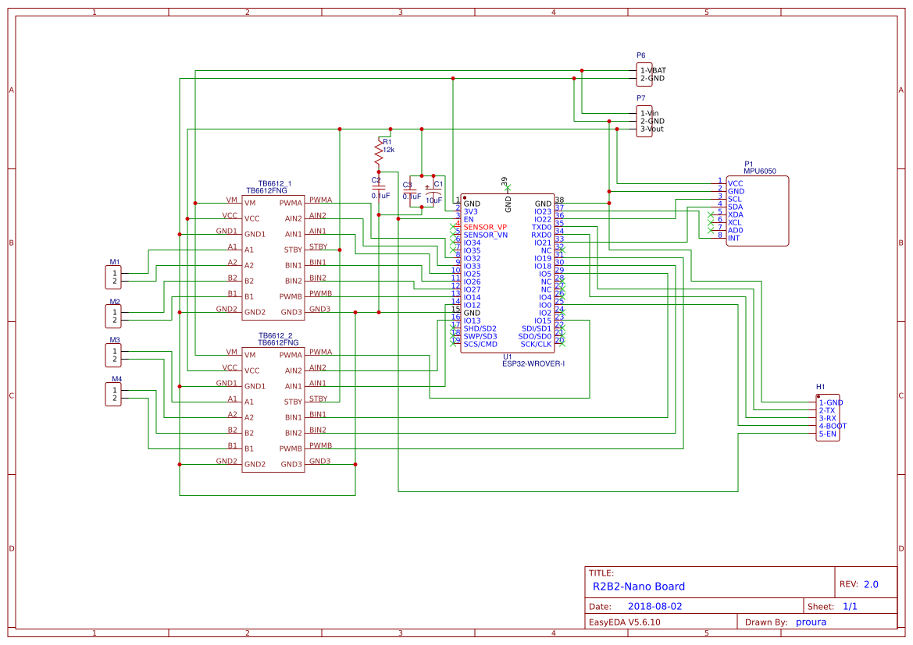

3. Electronica
==============

3.1. Alimentació
****************

Es pot trobar l'esquema electrònic "r2b2-nano-power" al projecte públic `R2B2-nano <https://easyeda.com/r2b2osrov/r2b2-nano>`_ allotjat a EASEYEDA.

.. image:: 10_power/10_01_power_schematic.png

3.2. Control
************

Es pot trobar l'esquema electrònic "r2b2-nano-board" al projecte públic `R2B2-nano <https://easyeda.com/r2b2osrov/r2b2-nano>`_ allotjat a EASEYEDA.

