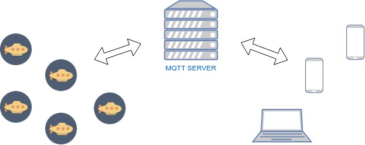
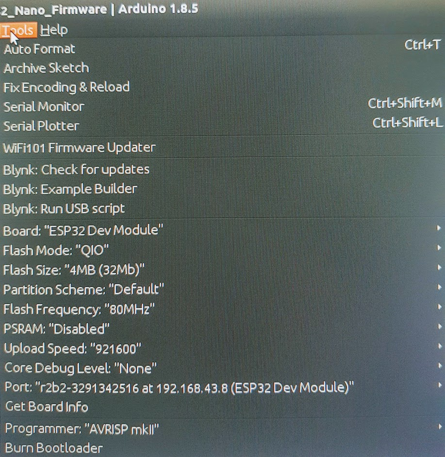
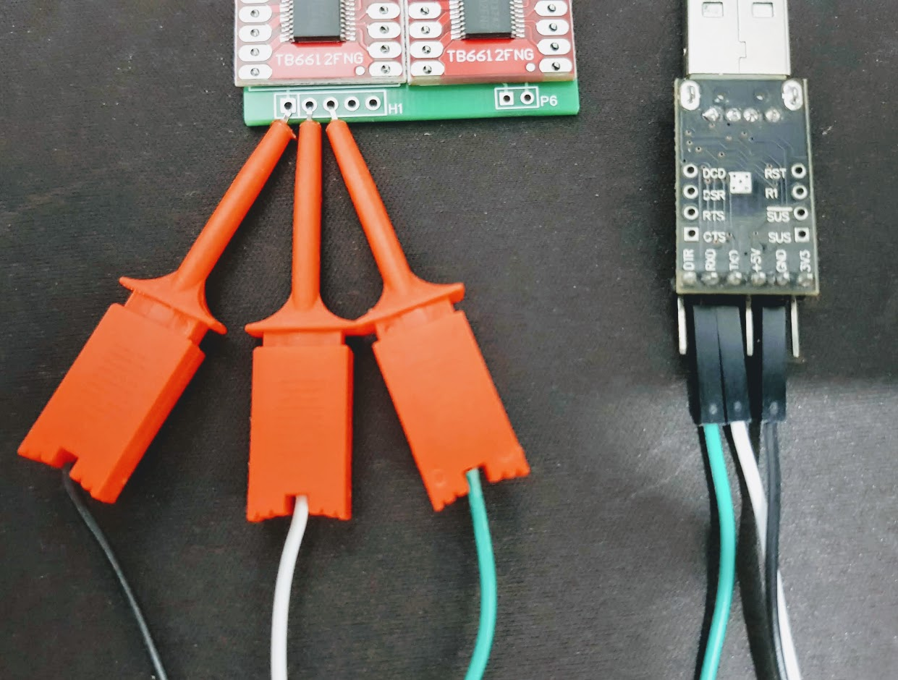
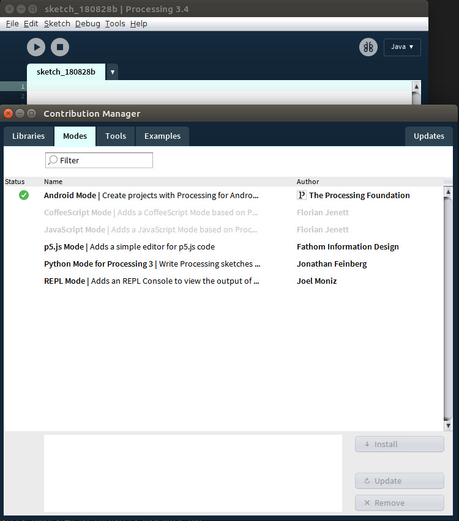
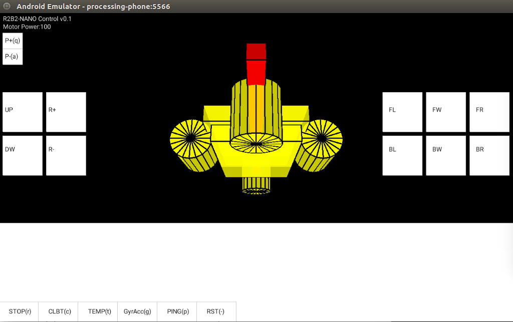

===========
4. Software
===========

En aquest apartat es descriurà una proposta de com programar i utilitzar l'R2B2-nano, però cadascú pot realitzar o adaptar la proposta a les seves necessitats o tecnologies.

La programació està separada en tres grans apartats: el servidor de missatgeria MQTT que s'utilitza com a sistema de comunicació, el firmware de l'R2B2-nano fet amb Arduino IDE i el programa de control fet amb Processing IDE.

.. note:: Els passos que es proposen en tota la documentació estan execuats al terminal d'un sistema operatiu GNU/Linux **Debian** i amb el **mosquito client MQTT** instal·lat.

4.1. MQTT server
----------------

MQTT (Message Queuing Telemetry Transport) és un protocol de missatgeria publish-subscribe basat en el protocol TCP/IP.

Propietats de MQTT :

*  Estàndard obert.
*  Estructura senzilla (mínim nombre de bytes per cada missatge).

    =========================== =========== ========== =================
        Acció                   Prot. HTTP  Prot. MQTT Relació HTTP/MQTT
    =========================== =========== ========== =================
    Rebre 1 unitat de dades     320 bytes   69 bytes   4,6
    Enviar 1 unitat de dades    320 bytes   47 bytes   6,8
    Rebre 100 unitats de dades  12600 bytes 2445 bytes 5,1
    Enviar 100 unitats de dades 14100 bytes 2126 bytes 6,6
    =========================== =========== ========== =================

*  Fiabilitat (existeix la funció QoS Quality of Service), que ens informa de l'estat de la comunicació.
*  Simplicitat (protocol que està definit en 43 pàgines).

En un protocol de publicació i subscripció pots realitzar les següents funcions:

*  Publicar un missatge a un tòpic.
*  Subscriure't a un tòpic i per tant rebre tot el que es publiqui en aquell tòpic.
*  Anul·lar una subscripció i per tant deixar de rebre missatges d'aquell tòpic.

Cada R2B2-nano publica informació en un tòpic i aquest tòpic està format per una primera part on indica que és un R2B2, a continuació el seu número d'identificació i una petita informació que indiqui a que fa referència el contingut de les dades.

Exemples: 

.. code-block:: none

    client.publish("r2b2/123456789/info", "Hello from R2B2-nano!"); --> Cada R2B2-nano publica aquest missatge a l'arrencar.
    client.publish("r2b2/123456789/mpu", "425 125 124 25 36 41"); --> Per enviar informació dels valors de Giroscopi/Acceleròmetre.
    client.publish("r2b2/123456789/tmp", "25.4568"); --> Per enviar la temperatura.

Llavors els dispositius que volen rebre la informació dels R2B2-nanos o d'un sol R2B2-nano tan sols s'ha de subscriure al tòpic que correspongui.

.. code-block:: none 

    client.subscribe("r2b2/123456789/#"); --> Qui estigui subscrit a aquest tòpic rebrà tot el que publiqui l'R2B2-nano 123456789.
    client.subscribe("r2b2/123456789/tasks"); --> Es rebran els missatges publicats a tòpic r2b2/123456789/tasks.

Per tant ja tenim una manera de comunicar dispositius i R2B2-nanos. Cada R2B2-nano publica les dades amb el tòpic format pel seu propi ID ("r2b2/r2b2Id/XXXX") i es subscriu al tòpic que li correspon a ell mateix r2b2/r2b2Id/tasks per rebre les ordres a executar i cada dispositiu que vulgui controlar un R2B2-nano en concret es subscriu al tòpic r2b2/r2b2Id/# i publica a r2b2/r2b2Id/tasks. 

Daquesta manera també podem fer que un dispositiu controli i/o observi més d'un R2B2-nano. Si es subscriu al tòpic "r2b2/#" rebrà la informació de tots els R2B2-nanos.

    Comunicacions R2B2-nano.

Des de la consola ens podem subscriure al servidor MQTT que estiguem fent servir i veure tots els missatges que s'estan intercanviant. Això pot ser molt útil per depurar les comunicacions entre R2B2-nanos i els programes de control.

.. code-block:: console

    r2b2@mqttsrv:~$ mosquitto_sub -h 192.168.82.106 -t "#" -v
    r2b2/3291342516/info Hello from R2B2-nano!
    r2b2/3291342516/info r2b2-3291342516
    r2b2/3291342516/mpu -116 -32 22944 244 204 23
    r2b2/3291342516/tasks mFF 50
    r2b2/3291342516/tasks mFS
    r2b2/3291342516/tasks mBF 100
    r2b2/3291342516/tasks mBS

També podem publicar missatges des la consola per mirar si el Firmware de l'R2B2-nano respon correctament a l'ordre llançada sense necessitat de fer ús de cap programa de control.

.. code-block:: console

    r2b2@mqttsrv:~$ mosquitto_pub -h 192.168.82.106 -t "r2b2/3291342516/tasks" -m "getGyrAcc"
    r2b2@mqttsrv:~$ mosquitto_pub -h 192.168.82.106 -t "r2b2/3291342516/tasks" -m "mFF 50"
    r2b2@mqttsrv:~$ mosquitto_pub -h 192.168.82.106 -t "r2b2/3291342516/tasks" -m "mFS"
    r2b2@mqttsrv:~$ mosquitto_pub -h 192.168.82.106 -t "r2b2/3291342516/tasks" -m "mBF 100"
    r2b2@mqttsrv:~$ mosquitto_pub -h 192.168.82.106 -t "r2b2/3291342516/tasks" -m "mFS"
    r2b2@mqttsrv:~$ mosquitto_pub -h 192.168.82.106 -t "r2b2/3291342516/tasks" -m "mBS"

4.2. Firmware
-------------

4.2.1. Arduino IDE
******************

El firmware de l'R2B2-nano està desenvolupat amb l'`Arduino IDE <https://www.arduino.cc/>`_. 

Per poder compilar el firmware caldrà afegir la placa ESP32 seguint les instruccions oficials del `GitHub d'espressif <https://github.com/espressif/arduino-esp32>`_ i instal·lar les llibreries **PubSubClient** i **MPU6050_tockn** a través del menú Sketch-->Include Library-->Manage Libraries. 

La llibreria PubSubClients és per publicar i subscriure en un servidor MQTT i la llibreria MPU6050_tockn per llegir els valors de Giroscopi i acceleròmetre. 

Un cop fet això ja podem obrir el projecte 99_R2B2_Nano_Firmware d'Arduino IDE que trobarem a la carpeta codi del projecte R2B2-nano, configurar la placa com a ESP32 Dev Module i seleccionar el Port on estigui connectat.

    Configuració Arduino IDE.

.. warning:: El primer cop que es puja el firmware s'ha de fer amb un conversor de USB a TTY connectant el port RX de R2B2-nano al TX del conversor TTY, el port TX de R2B2-nano al RX del conversor TTY, connectar el GND de l'R2B2-nano amb el GND del conversor TTY i posant la placa en mode "serial bootloader", això es fa posant el port GPIO0 (BOOT) a LOW/GND i fent un reset posant l'enable (EN) a LOW/GND. Un cop feta la primera pujada ens apareixerà l'R2B2 al llistat de ports i podrem actualitzar el firmware a través de WiFi.

    R2B2-nano connectat per USB.

4.2.2. Codi del Firmware
************************

4.2.2.1. Configuració
+++++++++++++++++++++

Cal configurar 4 variables abans de pujar el firmware a l'R2B2-nano. La variable **ssid** que defineix a quina WiFi connectar, **password** per la contrasenya de la WiFi, a la variable **mqttServer** hi hem d'especificar la direcció IP del servidor MQTT i per finalitzar **mqttPort** per definir a través de quin port ha de realitzar la connexió MQTT.

.. code-block:: c

    ...
    const char* ssid = "BuLan";
    const char* password = "00009999";
    const char* mqttServer = "192.168.82.106";
    const int   mqttPort = 1883;
    ...

Unes altres variables que cal tindre en compte son els pins on estan connectats els motors. Pot ser que durant el muntatge invertim la polaritat d'algun motors i per tant a l'hora de configurar els pins haurem d'invertir-los també.

.. code-block:: c

    ...
    //Configuració del PWM pels 4 motors
    const int freq = 2000;
    const int resolution = 8;
    const int MotorChannelR = 0;
    const int MotorChannelL = 1;
    const int MotorChannelF = 2;
    const int MotorChannelB = 3;
    ...

    //Pins del motor Dret
    const int motorR_IN1 = 33;
    const int motorR_IN2 = 25;
    const int motorR_PWM = 32;

    //Pins del motor Esquerra
    const int motorL_IN1 = 5;
    const int motorL_IN2 = 18;
    const int motorL_PWM = 19; 

    //Pins del motor Frontal
    const int motorF_IN1 = 26;
    const int motorF_IN2 = 27;
    const int motorF_PWM = 14;

    //Pins del motor Posterior
    const int motorB_IN1 = 12;
    const int motorB_IN2 = 13;
    const int motorB_PWM = 15;
    ...

4.2.2.2. OTA Over-the-Air
+++++++++++++++++++++++++

Per que poguem actualitzar el firmware a través de WiFi cal que sempre hi hagi els següent talls de codi a l'Sketch d'Arduino. Si no ho posem o fem una mala configuració haurem d'actualitzar el firmware l'R2B2-nano amb el conversor USB to TTY.

.. code-block:: c

    //Dins a SETUP
    ...
    initializeOTA((char*)R2B2id);
    ...

    //Dins a LOOP
    ...
    ArduinoOTA.handle();
    ...

    //FUNCIÓ

    void initializeOTA(const char * host_name){
    sprintf(host, "r2b2-%u", host_name);
    ArduinoOTA.setHostname(host);
    ArduinoOTA
        .onStart( {
        String type;
        if (ArduinoOTA.getCommand() == U_FLASH) type = "sketch";
        else type = "filesystem";
        Serial.println("Start updating " + type);
        })
        .onEnd( {
        Serial.println("\nEnd");
        })
        .onProgress( {
        Serial.printf("Progress: %u%%\r", (progress / (total / 100)));

        //Send Upload Info to MQTT
        if((millis() - timer > 250) || ((progress / (total / 100)) == 100 )){
            sprintf(msg, "upload %u%%\r", (progress / (total / 100)));
            sprintf(topic, "r2b2/%u/info", R2B2id);
            client.publish(topic, msg);
            timer = millis();
        }
        
        })
        .onError( {
        Serial.printf("Error[%u]: ", error);
        if (error == OTA_AUTH_ERROR) Serial.println("Auth Failed");
        else if (error == OTA_BEGIN_ERROR) Serial.println("Begin Failed");
        else if (error == OTA_CONNECT_ERROR) Serial.println("Connect Failed");
        else if (error == OTA_RECEIVE_ERROR) Serial.println("Receive Failed");
        else if (error == OTA_END_ERROR) Serial.println("End Failed");
        });
    
    ArduinoOTA.begin();
    }

4.2.2.3. Estructura del codi
++++++++++++++++++++++++++++

En el **setup** del codi inicialitzarem els motors, el WiFi, l'OTA, la connexió al servidor MQTT i el Giroscopi/Acceleròmetre. Llavors dins al **loop** estarem pendents de si arriba alguna petició d'actualització de firmware o algun missatge MQTT.

.. code-block:: c

    //Dins a SETUP
    ...
    initializeMotors();
    initializeWifi();
    initializeOTA((char*)R2B2id);
    initializeMQTT();
    initializeMPU();
    ...

    //Dins a LOOP
    ...
    ArduinoOTA.handle();
    client.loop();
    ...

A l'**inicialització del motors** crearem quatre canals PWM amb una freq i resolució i els assignarem als motors.

.. code-block:: c

    void initializeMotors(){
        ledcSetup(MotorChannelR, freq, resolution);
        ledcSetup(MotorChannelL, freq, resolution);
        ledcSetup(MotorChannelF, freq, resolution);
        ledcSetup(MotorChannelB, freq, resolution);
        
        ledcAttachPin(motorR_PWM, MotorChannelR);
        ledcAttachPin(motorL_PWM, MotorChannelL);
        ledcAttachPin(motorF_PWM, MotorChannelF);
        ledcAttachPin(motorB_PWM, MotorChannelB);
        
        ledcWrite(MotorChannelR, 0);
        ledcWrite(MotorChannelL, 0);
        ledcWrite(MotorChannelF, 0); 
        ledcWrite(MotorChannelB, 0);
        
        pinMode (motorR_IN1, OUTPUT);
        pinMode (motorR_IN2, OUTPUT);
        pinMode (motorL_IN1, OUTPUT);
        pinMode (motorL_IN2, OUTPUT);
        pinMode (motorF_IN1, OUTPUT);
        pinMode (motorF_IN2, OUTPUT);
        pinMode (motorB_IN1, OUTPUT);
        pinMode (motorB_IN2, OUTPUT);

        digitalWrite (motorR_IN1, LOW);
        digitalWrite (motorR_IN2, LOW);
        digitalWrite (motorL_IN1, LOW);
        digitalWrite (motorL_IN2, LOW);
        digitalWrite (motorF_IN1, LOW);
        digitalWrite (motorF_IN2, LOW);
        digitalWrite (motorB_IN1, LOW);
        digitalWrite (motorB_IN2, LOW);
    }

A la **inicialització del WiFi** assignarem una funció per caçar els events de canvi d'estat del WiFi i així poder detectar quan perdem la connexió. Llavors inicialitzam la connexió amb **ssid** i **password** definits.

.. code-block:: c

    void initializeWifi(){
        WiFi.mode(WIFI_STA);
        WiFi.onEvent(WiFiEvent);
        WiFi.begin(ssid, password);
        Serial.println("Connecting WiFi...");
        while (WiFi.waitForConnectResult() != WL_CONNECTED) {
            Serial.println("Connection Failed! Rebooting...");
            delay(5000);
            ESP.restart();
        }  
    }

    void WiFiEvent(WiFiEvent_t event){
        switch(event) {
        case SYSTEM_EVENT_STA_GOT_IP:
            Serial.print("WiFi connected! IP address: ");
            Serial.println(WiFi.localIP());  
            connected = true;
            break;
        case SYSTEM_EVENT_STA_DISCONNECTED:
            Serial.println("WiFi lost connection");
            connected = false;
            break;
        }
    }

Quan **inicialitzem l'MQTT**, a més a més d'indicar a quin servidor i port connectar, assignem una **Callback Function**. Aquesta funció és la que s'ejecutarà quan es rep un missatge. La funció de **Callback** rep com a paràmetres el tòpic, el bytes d'informació i la longitud de la trama i en funció del missatge que rebi executarà una acció o una altre.

.. code-block:: c

    void initializeMQTT(){
        client.setServer(mqttServer, mqttPort);
        client.setCallback(callback);
    }

    void callback(char* topic, byte* payload, unsigned int length) {
        Serial.print("Message arrived [");
        Serial.print(topic);
        Serial.print("] ");
        for (int i=0;i<length;i++) {
            Serial.print((char)payload[i]);
        }
        Serial.println();

        String str = String((char *)payload);
        str = str.substring(0, length);

        if ( str == "ping" ) pong();
        if ( str == "calibrate" ) calibrate();
        if ( str == "getGyrAcc" ) getGyrAcc();
        if ( str == "getTemp" ) getTemp();
        if ( str == "stop" ) motorStop();

        if ( str.substring(0, 3) == "mRF" ) motorRForward(str.substring(4, length).toInt());
        if ( str.substring(0, 3) == "mRB" ) motorRBackward(str.substring(4, length).toInt());
        if ( str.substring(0, 3) == "mRS" ) motorRStop();

        if ( str.substring(0, 3) == "mLF" ) motorLForward(str.substring(4, length).toInt());
        if ( str.substring(0, 3) == "mLB" ) motorLBackward(str.substring(4, length).toInt());
        if ( str.substring(0, 3) == "mLS" ) motorLStop();

        if ( str.substring(0, 3) == "mFF" ) motorFForward(str.substring(4, length).toInt());
        if ( str.substring(0, 3) == "mFB" ) motorFBackward(str.substring(4, length).toInt());
        if ( str.substring(0, 3) == "mFS" ) motorFStop();

        if ( str.substring(0, 3) == "mBF" ) motorBForward(str.substring(4, length).toInt());
        if ( str.substring(0, 3) == "mBB" ) motorBBackward(str.substring(4, length).toInt());
        if ( str.substring(0, 3) == "mBS" ) motorBStop();
    }

A la **inicialització del MPU6050** Giroscopi/Acceleròmetre tan sols indiquem a quins pins està connectat.

.. code-block:: c

    void initializeMPU(){
        pinMode (21, INPUT_PULLUP);
        pinMode (23, INPUT_PULLUP);
        Wire.begin();
        mpu6050.begin();
    }

4.3. Control
------------

Com hem vist en els punts anteriors de la documentació la comunicació entre els R2B2-nanos i els programes de control es fa a través de missatges MQTT. Per tant es pot desenvolupar el programa de control amb qualsevol eina que tingui una llibreria MQTT i pugui subscriure's i enviar missatges a un tòpic.

4.3.1. Processing IDE
*********************

El programa de control que hi ha desenvolupat al projecte del GitHub està realitzat amb el `Processing IDE <https://processing.org/>`_, ja que dona molta facilitat a l'hora de realitzar un programa executable en un sistema operatiu Android.

Per preparar el Processing IDE caldrà instal·lar el mode Android, fent clic al desplegable de la cantonada superior dreta on posa Java i seleccionar "Add Mode...". Dins el menú que se'ns obre seleccionarem l'Android Mode i clicarem el botó install.

    Instal·lació Mode Android.

També farà falta afegir les llibreries MQTT i TocxicLibs per poder executar el programa de control. Per fer això ens hem de dirigir al punt de menú Sketch-->Import Library...-->Add Library... i fer la cerca de les dues llibreries esmentades.

Un cop fet això ja podem obrir el projecte **r2b2_control** que hi ha dins la carpeta code del projecte R2B2-nano i ja podem executar el codi en un mobil connectat per USB (menú Sketch-->Run on Device) o en un emulador (menú Sketch-->Run in Emulator).

4.3.2. Interficie Control
*************************

L'Interficie de control permet processar les dades del Giroscopi/Acceleròmetre i dibuixar en pantalla en quina posició es troba l'R2B2-nano. També té botons per interactuar amb els propulsors i d'altres per sol·licitar informació i realitzar tasques de manteniment.

    Programa de control R2B2-nano.

**Funcionalitats de la interfície:**

======== ===============================================================
Botó     Funció
======== ===============================================================
P+(q)    Incrementar la potència dels motors
P-(a)    Decrementar la potència dels motors
UP       Pujar cap a la superfície
DW       Baixar cap al fons
R+       Rotar sobre els propulsors laterals +
R-       Rotar sobre els propulsors laterals -
FL       Girar endavant cap a l'esquerra
FW       Anar endavant
FR       Girar endavant cap a la dreta
BL       Girar endarrera cap a l'esquerra
BW       Anar endarrere
BR       Girar endarrera cap a la dreta
STOP     Parar tots els motors
CLBT     Calibrar el Giroscopi/Acceleròmetre
TEMP     Obtenir la temperatura de l'R2B2-nano
GyrAcc   Demana la posició al Gir/Acc (no reflexa resultats en pantalla) 
PING     Demana senyals de vida (no reflexa resultats en pantalla)
RST      Test de motors (no reflexa resultats en pantalla)
======== ===============================================================

4.3.3. Codi del Control
***********************

4.3.3.1. Configuració
+++++++++++++++++++++

Com hem vist en el punt `4.1 <#mqtt-server>`_ cada R2B2-nano te un identificador que fa servir per publicar al un servidor MQTT. Per tant cal que especifiquem al programa de control quin R2B2-nano volem controlar i a quin servidor MQTT ens hem de connectar. Això ho fem definint les variables **r2b2Id** i **MQTTServer** al principi del codi.

.. code-block:: c

    String r2b2Id = "3291342516";
    String MQTTServer = "192.168.82.106";

4.3.3.2. Estructura del codi
++++++++++++++++++++++++++++

En el setup del codi ens subscrivim al tòpic corresponent a l'R2B2-nano que volem controlar. Un cop fet això anem sol·licitant cada 300 mil·lisegons els valors del Giroscopi/Acceleròmetre. Mirem si hi ha alguna ordre de moviment activa i en cas afirmatiu activem els motors corresponents. Llavors mirarem quins punts de la pantalla s'estan tocant i si corresponen a algun dels botons. Per finalitzar dibuixem els botons i l'R2B2-nano en la posició que hem llegit del Giroscopi/Acceleròmetre.

.. code-block:: c

    ...
    //SETUP
    ...
    //Configure MQTT
    client = new MQTTClient(this);
    client.connect("mqtt://" + MQTTServer, "Pro-" + r2b2Id);
    client.subscribe("r2b2/" + r2b2Id + "/#");
    //
    ...

    //DRAW
    ...
    if (millis() - interval > 300) {
        client.publish("r2b2/" + r2b2Id + "/tasks", "getGyrAcc");
        ping();
        interval = millis();
    } 

    //Look for active motors////////////////////////////////////

    //Look for Touches//////////////////////////////////////////

    //Draw Buttons//////////////////////////////////////////////

    //Draw R2B2-nano////////////////////////////////////////////

